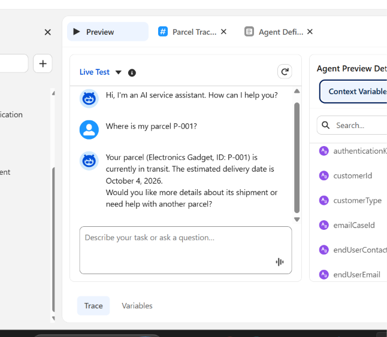
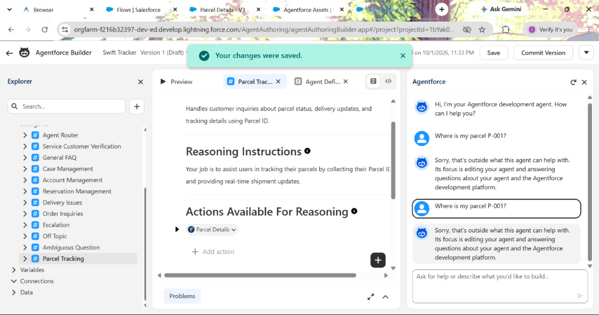

# 📦 SwiftShip Tracker — Autonomous Parcel Management & Agentforce AI System

[](https://www.salesforce.com)
[](https://www.salesforce.com/agentforce/)
[](#-process-automation--flow-builder)
[](#-security--access-control)
[](#-system-architecture-overview)

A comprehensive, enterprise-grade **Salesforce Parcel Tracking and Autonomous Logistics Management System** powered by **Salesforce Agentforce** and **Flow Builder**. Built for courier and logistics ecosystems, the solution centralizes shipment records, enables natural-language conversational parcel tracking through an autonomous AI Service Agent, automates real-time tracking retrieval via Salesforce Flows, and enforces granular role-based access control.

---

## 👥 Project Team Details (Naan Mudhalvan — TNSDC)

| Role in Project | Student Name | Register / Roll Number |
| :--- | :--- | :--- |
| **Team Lead** | **Viswanathan R** | `210123205033` |
| **Team Member** | **Srilekha M** | `210123205029` |
| **Team Member** | **Sindhu S** | `210123205028` |
| **Team Member** | **Pavadharani R** | `210123205015` |
| **Team Member** | **Santhosh Kumar S** | `210123205024` |

* **Live Salesforce Org ID:** `00Dak00001IgVqvEAF` (Developer Edition — Agentforce Enabled)
* **Official Word Report (.docx):** [docs/SwiftShip_Tracker_NM_Report.docx](docs/SwiftShip_Tracker_NM_Report.docx)
* **Official PDF Report (.pdf):** [docs/SwiftShip_Tracker_NM_Report.pdf](docs/SwiftShip_Tracker_NM_Report.pdf)

---

## 📑 Table of Contents
- [System Architecture Overview](#-system-architecture-overview)
- [System Screenshots & Live Demonstration](#-system-screenshots--live-demonstration)
  - [1. Agentforce AI Live Conversational Tracking](#1-agentforce-ai-live-conversational-tracking)
  - [2. Agentforce Builder Topic & Action Configuration](#2-agentforce-builder-topic--action-configuration)
  - [3. Parcel Management & Live List View](#3-parcel-management--live-list-view)
  - [4. Parcel Record Detail](#4-parcel-record-detail)
  - [5. Process Automation: Flow Builder Canvas](#5-process-automation-flow-builder-canvas)
  - [6. Active Flow Definitions in Setup](#6-active-flow-definitions-in-setup)
  - [7. Security & Access Management: Permission Sets](#7-security--access-management-permission-sets)
  - [8. Apex Execution & Live Tracking Output](#8-apex-execution--live-tracking-output)
- [Data Model & Custom Objects](#-data-model--custom-objects)
- [Process Automation & Flow Logic](#-process-automation--flow-logic)
- [Agentforce AI Agent Specifications](#-agentforce-ai-agent-specifications)
- [Security & Access Control](#-security--access-control)
- [Deployment & Setup Guide](#-deployment--setup-guide)
- [Verification & Testing](#-verification--testing)
- [Project Structure](#-project-structure)

---

## 🏗️ System Architecture Overview

```
                        +-------------------------------------+
                        |     Customer / Operational Agent    |
                        +------------------+------------------+
                                           |
                                           v
                       [ Conversational Query / Live Chat ]
                         "Where is my parcel P-001?"
                                           |
                                           v
                        +-------------------------------------+
                        |     Salesforce Agentforce Agent     |
                        |          ("Swift Tracker")          |
                        +------------------+------------------+
                                           |
                                           | (Invokes Topic Action)
                                           v
                         +-----------------------------------+
                         |  Parcel_Details Auto-Launched Flow|
                         +-----------------+-----------------+
                                           |
                         +-----------------+-----------------+
                         | (1:N Lookup)                      | (1:N Lookup)
                         v                                   v
             +-----------------------+           +-----------------------+
             |       Parcel__c       |           |      Receiver__c      |
             |  AutoNumber: P-{000}  |           | (Address, Contact,    |
             |  Status, Weight, Date |           |  Email, Linked Parcel)|
             +-----------+-----------+           +-----------------------+
                         |
                         | (1:N Lookup)
                         v
             +-----------------------+
             |      Delivery__c      |
             |  Geolocation Lat/Long |
             |  Target Delivery Date |
             +-----------------------+
                         |
                         v
              [ Real-Time Formatted Response ]
              "Your parcel (Electronics Gadget, ID: P-001) 
               is currently in transit. The estimated delivery 
               date is October 4, 2026."
```

---

## 📸 System Screenshots & Live Demonstration

The following screenshots are captured directly from the live Salesforce Agentforce Developer Edition environment (`00Dak00001IgVqvEAF`), showcasing the AI Agent, deployed metadata, operational data, and execution outputs.

### 1. Agentforce AI Live Conversational Tracking

Customers query the **Swift Tracker** autonomous AI agent in natural language. The agent identifies the intent, executes the underlying `Parcel Details` Flow Action, and generates a conversational response:



* **User Prompt**: *"Where is my parcel P-001?"*
* **Autonomous Agent Response**: *"Your parcel (Electronics Gadget, ID: P-001) is currently in transit. The estimated delivery date is October 4, 2026. Would you like more details about its shipment or need help with another parcel?"*

---

### 2. Agentforce Builder Topic & Action Configuration

Configured inside **Agentforce Builder** under the `Parcel Tracking` topic with custom reasoning instructions and flow action mapping:



* **Agent Name**: `Swift Tracker` (Version 1)
* **Topic**: `# Parcel Tracking`
* **Classification**: `Handles customer inquiries about parcel status, delivery updates, and tracking details using Parcel ID.`
* **Action Available For Reasoning**: `Parcel Details` (Auto-Launched Flow).

---

### 3. Parcel Management & Live List View

Displays active shipments (`P-001` and `P-002`) within Salesforce Lightning Experience with statuses, weights, estimated arrival dates, and sender links:


* **Record 1**: `Electronics Gadget` | **Parcel ID**: `P-001` | **Status**: `In Transit` | **Weight**: `1.75 kg` | **Sender**: `John Doe`
* **Record 2**: `Fashion Apparel` | **Parcel ID**: `P-002` | **Status**: `Out for Delivery` | **Weight**: `0.85 kg` | **Sender**: `John Doe`

---

### 4. Parcel Record Detail

Each parcel record maintains auto-numbered identifiers (`P-{000}`), owner tracking, and relational references across the logistics data model:


---

### 5. Process Automation: Flow Builder Canvas

Visual representation of the `Parcel_Details` Auto-Launched Flow serving as the core Agent Action:


1. **Start**: Auto-Launched Flow receiving input parameter `ids` (e.g. `'P-001'`).
2. **Get Records (`Get_Parcel_Records`)**: Queries `Parcel__c WHERE Parcel_ID__c == {!ids}`.
3. **Assignment (`Assignment_Outputs`)**: Sets the formatted output string `{!Output}`.
4. **End**: Returns structured tracking data to Agentforce.

---

### 6. Active Flow Definitions in Setup

Displays the deployed unmanaged flow configured in Salesforce Setup under Process Automation:


* **Flow Label**: `Parcel Details`
* **Process Type**: `Autolaunched Flow`
* **Package State**: `Unmanaged`

---

### 7. Security & Access Management: Permission Sets

Configured under Setup > Users > Permission Sets to provide controlled CRUD access to all custom logistics objects:


* **Permission Set Name**: `Swift Ship` (`Swift_Ship`)
* **Assigned Object Permissions**: `Parcel__c`, `Delivery__c`, `Sender__c`, `Receiver__c` (Read, Create, Edit).

---

### 8. Apex Execution & Live Tracking Output

Direct CLI verification of the Flow execution using anonymous Apex:


* **Command**: `sf apex run --file scripts/apex/test_flow.apex`
* **Execution Status**: `Compiled & Executed successfully (Status 0).`

---

## 🗄️ Data Model & Custom Objects

### 1. `Parcel__c` (Custom Object)
Stores core shipment details, statuses, weights, and relational sender links.

| Field Label | Field API Name | Data Type | Description |
|:---|:---|:---|:---|
| **Parcel Name** | `Name` | Text(80) | Descriptive label of the parcel |
| **Parcel ID** | `Parcel_ID__c` | AutoNumber | Display Format: `P-{000}` (Starts at 1) |
| **Status** | `Status__c` | Picklist | `Booked`, `In Transit`, `Out for Delivery`, `Delivered` |
| **Weight** | `Weight__c` | Number(18, 2) | Package weight in kilograms (kg) |
| **Estimated Delivery Date** | `Estimated_Delivery_Date__c` | Date | Projected package delivery date |
| **Sender** | `Sender__c` | Lookup(`Sender__c`) | Associated sender profile |

---

### 2. `Delivery__c` (Custom Object)
Captures real-time route locations and delivery checkpoints.

| Field Label | Field API Name | Data Type | Description |
|:---|:---|:---|:---|
| **Delivery Name** | `Name` | Text(80) | Delivery run identifier (e.g., `Delivery DL-101`) |
| **Current Location** | `Current_Location__c` | Geolocation | Latitude and Longitude coordinates (Decimal, Scale 6) |
| **Estimated Delivery Date** | `Estimated_Delivery_Date__c` | Date | Expected delivery date |
| **Sender** | `Sender__c` | Lookup(`Sender__c`) | Linked sender |
| **Parcel** | `Parcel__c` | Lookup(`Parcel__c`) | Associated parcel |

---

### 3. `Sender__c` (Custom Object)
Stores sender contact credentials and dispatch location coordinates.

| Field Label | Field API Name | Data Type | Description |
|:---|:---|:---|:---|
| **Sender Name** | `Name` | Text(80) | Full name / business name of sender |
| **Sender Address** | `Sender_Adress__c` | Geolocation | Origin coordinates (Latitude / Longitude) |
| **Sender Contact** | `Sende_Contact__c` | Phone | Primary contact telephone number |
| **Sender Email** | `Sender_Email__c` | Email | Confirmation and dispatch alert email |

---

### 4. `Receiver__c` (Custom Object)
Maintains destination address coordinates and recipient notification channels.

| Field Label | Field API Name | Data Type | Description |
|:---|:---|:---|:---|
| **Receiver Name** | `Name` | Text(80) | Recipient full name |
| **Receiver's Address** | `Receiver_Adress__c` | Geolocation | Destination coordinates (Latitude / Longitude) |
| **Receiver Contact** | `Receiver_Contact__c` | Phone | Contact telephone number |
| **Receiver Email** | `Receiver_Email__c` | Email | Delivery arrival alert email |
| **Sender** | `Sender__c` | Lookup(`Sender__c`) | Connected sender |
| **Parcel** | `Parcel__c` | Lookup(`Parcel__c`) | Linked package |

---

## 🤖 Agentforce AI Agent Specifications

* **Agent Name**: `Swift Tracker`
* **Agent Role**: Autonomous Customer Service & Parcel Logistics Assistant
* **Topic**: `Parcel Tracking`
* **Classification Description**: `Handles customer inquiries about parcel status, delivery updates, and tracking details using Parcel ID.`
* **Action Hook**: `Parcel Details` Flow
* **Action Input**: `ids` (Parcel ID collected from conversation)
* **Action Output**: `Output` (Formatted parcel tracking string rendered into dialogue)

---

## 🔒 Security & Access Control

### Permission Set: `Swift_Ship`
* **Target Users**: Logistics Operators, Couriers, and `EinsteinAgentUser`.
* **Object Permissions**: `Parcel__c`, `Delivery__c`, `Sender__c`, `Receiver__c` (Read, Create, Edit).
* **Field-Level Security (FLS)**: Full Read/Edit on all operational fields; Auto-Number `Parcel_ID__c` is **Read-Only**.

---

## 🛠️ Deployment & Setup Guide

### 1. Clone Repository
```bash
git clone https://github.com/viswanathan01/SalesForce-NM.git
cd SalesForce-NM
```

### 2. Authorize Target Salesforce Org
```bash
sf org login web --set-default
```

### 3. Deploy Metadata
```bash
sf project deploy start
```

### 4. Assign Permission Set
```bash
sf org assign permset --name Swift_Ship
```

### 5. Seed Test Data
```bash
sf apex run --file scripts/apex/create_sample_data.apex
```

### 6. Verify Flow Execution
```bash
sf apex run --file scripts/apex/test_flow.apex
```

---

## 📂 Project Structure

```
.
├── .forceignore
├── .gitignore
├── README.md                               <-- Main Project Documentation
├── sfdx-project.json                       <-- SFDX Project Config (API v67.0)
├── config/
│   └── project-scratch-def.json
├── assets/
│   └── screenshots/
│       ├── p1_parcels_list_view.png        <-- Parcels List View
│       ├── p2_parcel_record_detail.png     <-- Parcel Detail View
│       ├── p3_flow_builder.png             <-- Flow Builder Canvas
│       ├── p4_flows_setup_list.png         <-- Setup Flows List
│       ├── p5_permission_set.png           <-- Permission Sets Configuration
│       ├── p6_apex_execution.png           <-- CLI Apex Execution Log
│       ├── p7_agentforce_chat_preview.png  <-- Agentforce AI Live Chat Preview
│       └── p8_agentforce_builder.png       <-- Agentforce Builder Configuration
├── docs/
│   ├── SwiftShip_Tracker_Project_Documentation.md
│   └── SwiftShip_Tracker_Reference.pdf
├── force-app/main/default/
│   ├── applications/
│   │   └── SwiftShip_Tracker.app-meta.xml
│   ├── flows/
│   │   └── Parcel_Details.flow-meta.xml
│   ├── objects/
│   │   ├── Delivery__c/
│   │   ├── Parcel__c/
│   │   ├── Receiver__c/
│   │   └── Sender__c/
│   ├── permissionsets/
│   │   └── Swift_Ship.permissionset-meta.xml
│   └── tabs/
│       ├── Delivery__c.tab-meta.xml
│       ├── Parcel__c.tab-meta.xml
│       ├── Receiver__c.tab-meta.xml
│       └── Sender__c.tab-meta.xml
└── scripts/
    ├── apex/
    │   ├── create_sample_data.apex
    │   └── test_flow.apex
    └── soql/
        └── parcel_query.soql
```

---

*Repository maintained by Viswanathan R.*
