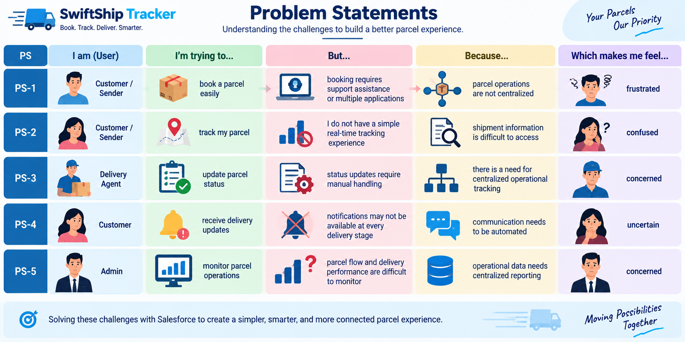
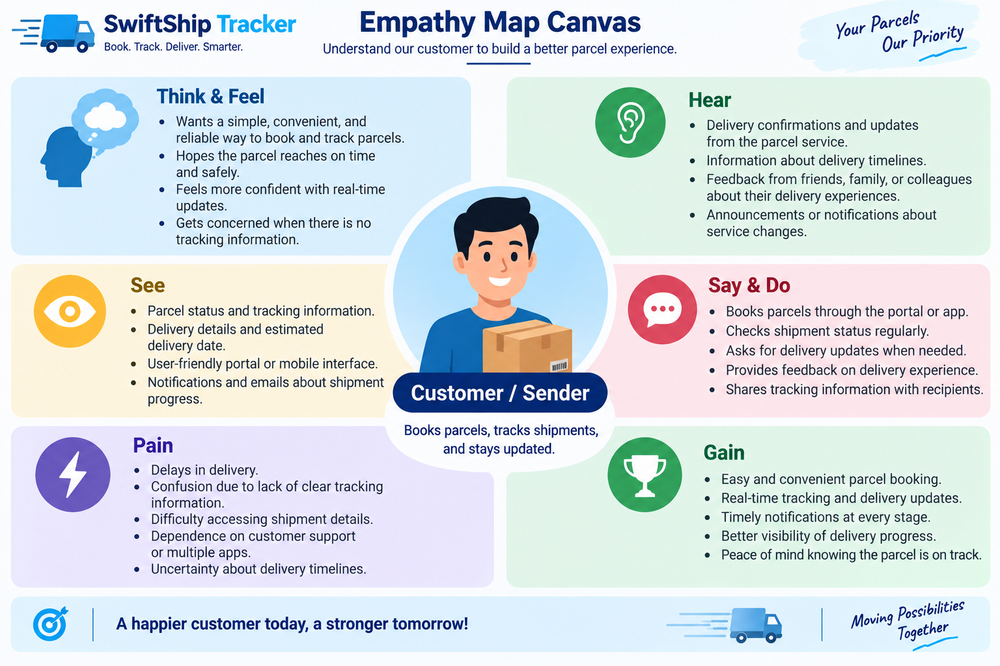
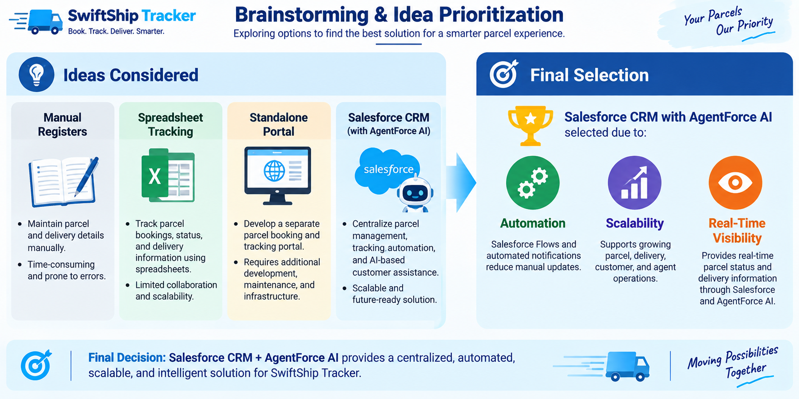
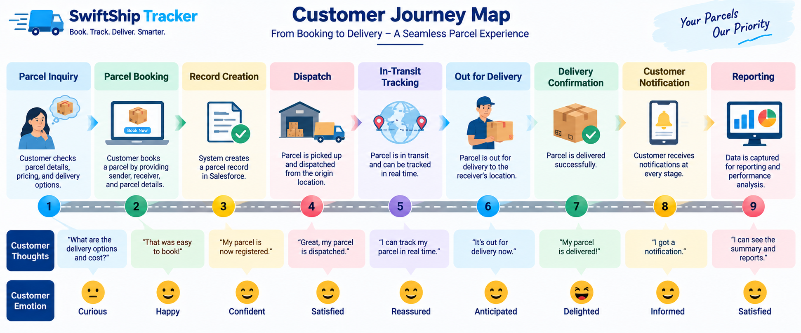
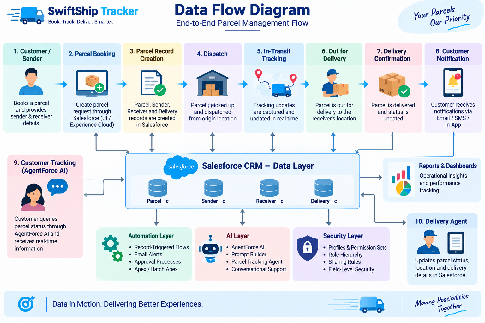
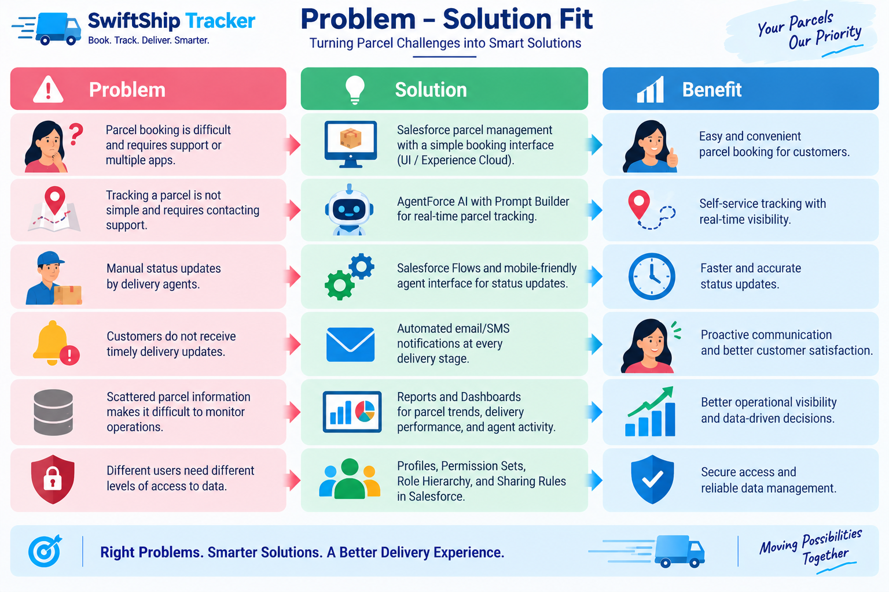
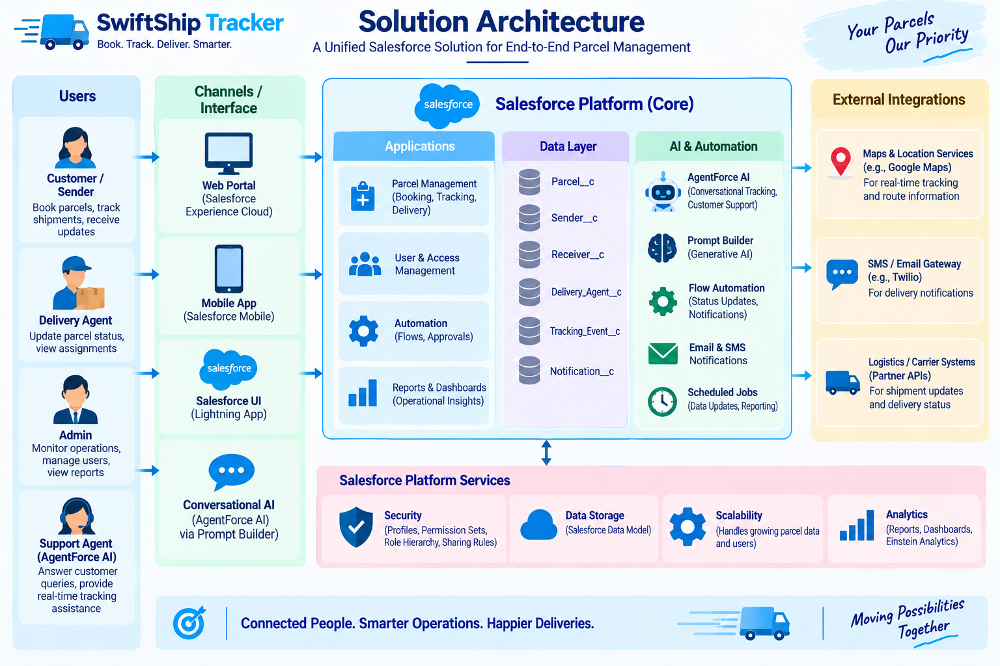

# 📦 SwiftShip Tracker — Autonomous Parcel Management & Agentforce AI System

<p align="center">
  
</p>

[](https://www.salesforce.com)
[](https://www.salesforce.com/agentforce/)
[](#-process-automation--flow-builder)
[](#-security--access-control)
[](#-project-team--institution-details)

A comprehensive, enterprise-grade **Salesforce Parcel Tracking and Autonomous Logistics Management System** powered by **Salesforce Agentforce** and **Flow Builder**. Built for courier and logistics ecosystems, the solution centralizes shipment records, enables natural-language conversational parcel tracking through an autonomous AI Service Agent, automates real-time tracking retrieval via Salesforce Flows, and enforces granular role-based access control.

---

## 👥 Project Team & Institution Details

* **Institution:** **Alpha College of Engineering, Thirumazhisai, Chennai** *(Approved by AICTE and Affiliated to Anna University)*
* **Naan Mudhalvan Team ID:** `6ab4dab10fc666a751b55876`
* **Live Salesforce Org ID:** `00Dak00001IgVqvEAF` (Developer Edition — Agentforce Enabled)
* **Official PDF Report (.pdf):** [SwiftShip_Tracker_NM_Report.pdf](SwiftShip_Tracker_NM_Report.pdf) *(also in [docs/](docs/SwiftShip_Tracker_NM_Report.pdf))*
* **Official Word Report (.docx):** [SwiftShip_Tracker_NM_Report.docx](SwiftShip_Tracker_NM_Report.docx) *(also in [docs/](docs/SwiftShip_Tracker_NM_Report.docx))*
* **Salesforce Implementation Screenshots:** [salesforce_screenshots/](salesforce_screenshots/)
* **Detailed Technical Documentation:** [docs/SwiftShip_Tracker_Project_Documentation.md](docs/SwiftShip_Tracker_Project_Documentation.md)

### Team Members

| Role in Project | Student Name | Register Number | College Email ID |
| :--- | :--- | :--- | :--- |
| **Team Lead** | **Viswanathan R** | `210123205033` | `nviswa192@gmail.com` |
| **Team Member** | **Srilekha M** | `210123205029` | `srims0912@gmail.com` |
| **Team Member** | **Sindhu S** | `210123205028` | `sindhubava05@gmail.com` |
| **Team Member** | **Pavadharani R** | `210123205015` | `rishvibommika@gmail.com` |
| **Team Member** | **Santhosh Kumar S** | `210123205024` | `mrsanthosh3345@gmail.com` |

---

## 📑 Table of Contents
- [System Architecture Overview](#-system-architecture-overview)
- [System Screenshots & Live Implementation Evidence](#-system-screenshots--live-implementation-evidence)
  - [1. Agentforce Autonomous AI Agent](#1-agentforce-autonomous-ai-agent)
  - [2. Custom Logistics Application & Operational Data](#2-custom-logistics-application--operational-data)
  - [3. Process Automation: Flow Builder & Execution](#3-process-automation-flow-builder--execution)
  - [4. Security & Access Control: Permission Sets](#4-security--access-control-permission-sets)
  - [5. Custom Object Manager Schemas](#5-custom-object-manager-schemas)
- [Design Thinking & Architectural Diagrams](#-design-thinking--architectural-diagrams)
- [Data Model & Custom Objects Schema](#-data-model--custom-objects-schema)
- [Agentforce AI Agent Specifications](#-agentforce-ai-agent-specifications)
- [Security & Access Control](#-security--access-control)
- [Deployment & Setup Guide](#-deployment--setup-guide)
- [Verification & Testing](#-verification--testing)
- [Project Directory Structure](#-project-directory-structure)

---

## 🏗️ System Architecture Overview

```
                        +-------------------------------------+
                        |     Customer / Operational Agent    |
                        +------------------+------------------+
                                           |
                                           v
                        [ Conversational Query / Live Chat ]
                          "Where is my parcel P-001?"
                                           |
                                           v
                        +-------------------------------------+
                        |     Salesforce Agentforce Agent     |
                        |          ("Swift Tracker")          |
                        +------------------+------------------+
                                           |
                                           | (Invokes Topic Action)
                                           v
                         +-----------------------------------+
                         |  Parcel_Details Auto-Launched Flow|
                         +-----------------+-----------------+
                                           |
                         +-----------------+-----------------+
                         | (1:N Lookup)                      | (1:N Lookup)
                         v                                   v
             +-----------------------+           +-----------------------+
             |       Parcel__c       |           |      Receiver__c      |
             |  AutoNumber: P-{000}  |           | (Address, Contact,    |
             |  Status, Weight, Date |           |  Email, Linked Parcel)|
             +-----------+-----------+           +-----------------------+
                         |
                         | (1:N Lookup)
                         v
             +-----------------------+
             |      Delivery__c      |
             |  Geolocation Lat/Long |
             |  Target Delivery Date |
             +-----------------------+
                         |
                         v
              [ Real-Time Grounded Response ]
              "Your parcel (Electronics Gadget, ID: P-001) 
               is currently in transit. The estimated delivery 
               date is October 4, 2026."
```

---

## 📸 System Screenshots & Live Implementation Evidence

All screenshots are captured directly from the live Salesforce Agentforce Developer Edition environment (`00Dak00001IgVqvEAF`), demonstrating full operational capability.

### 1. Agentforce Autonomous AI Agent

Customers interact with the **Swift Tracker** autonomous AI agent in natural conversational English. The reasoning engine detects the parcel inquiry, autonomously triggers the `Parcel Details` Flow Action, and grounds the response using live CRM data.

| Live Grounded Reasoning & Output Trace | Agentforce Builder Topic `# Parcel Tracking` |
| :---: | :---: |
|  |  |

* **Active Agentforce Agents List in Setup:**
  

---

### 2. Custom Logistics Application & Operational Data

The **SwiftShip Tracker** custom Lightning application provides operators and couriers with centralized views for tracking parcels, delivery checkpoints, and recipient information.

| All Parcels Active View (`P-001` through `P-004`) | All Deliveries View (with GPS Coordinates) |
| :---: | :---: |
|  |  |

| All Receivers View | Parcel Record Detail Page Layout |
| :---: | :---: |
|  |  |

---

### 3. Process Automation: Flow Builder & Execution

The autolaunched Flow `Parcel_Details` handles deterministic data retrieval and formats responses back to the Agentforce runtime.

| Flow Builder Debug Canvas (Execution for `P-001`) | Active Flow Definitions in Setup |
| :---: | :---: |
|  |  |

---

### 4. Security & Access Control: Permission Sets

The `Swift_Ship` Permission Set enforces least-privilege access across the custom schema, granting CRUD permissions to both Human Administrators and the `EinsteinServiceAgent User`.


---

### 5. Custom Object Manager Schemas

Four custom objects were engineered in Salesforce Object Manager with relational integrity and custom Geolocation fields:

| Parcel Custom Object (`Parcel__c`) | Delivery Custom Object (`Delivery__c`) |
| :---: | :---: |
|  |  |

| Sender Custom Object (`Sender__c`) | Receiver Custom Object (`Receiver__c`) |
| :---: | :---: |
|  |  |

---

## 🎨 Design Thinking & Architectural Diagrams

The project was conceptualized using Stanford d.school Design Thinking principles, progressing through Empathy Mapping, Ideation, Customer Journey Mapping, and Agile Sprints.

| Empathy Map Canvas | Brainstorming & Ideation |
| :---: | :---: |
|  |  |

| Customer Journey Map | Solution Requirements Traceability |
| :---: | :---: |
|  |  |

| Data Flow Diagram (DFD Level 0 & 1) | Solution Architecture & Integration |
| :---: | :---: |
|  |  |

| Agile Sprint Velocity & Burndown Chart |
| :---: |
|  |

---

## 🗄️ Data Model & Custom Objects Schema

### 1. `Parcel__c` (Custom Object)
Stores core shipment details, statuses, weights, and relational sender links.

| Field Label | Field API Name | Data Type | Description / Constraints |
|:---|:---|:---|:---|
| **Parcel Name** | `Name` | Text(80) | Descriptive label of the parcel |
| **Parcel ID** | `Parcel_ID__c` | AutoNumber | Display Format: `P-{000}` (Starts at 1) |
| **Status** | `Status__c` | Picklist | `Booked`, `In Transit`, `Out for Delivery`, `Delivered` |
| **Weight** | `Weight__c` | Number(18, 2) | Package weight in kilograms (kg) |
| **Estimated Delivery Date** | `Estimated_Delivery_Date__c` | Date | Projected package delivery date |
| **Sender** | `Sender__c` | Lookup(`Sender__c`) | Associated sender profile |

---

### 2. `Delivery__c` (Custom Object)
Captures real-time route locations and delivery checkpoints.

| Field Label | Field API Name | Data Type | Description / Constraints |
|:---|:---|:---|:---|
| **Delivery Name** | `Name` | Text(80) | Delivery run identifier (e.g., `Delivery DL-101`) |
| **Current Location** | `Current_Location__c` | Geolocation | Latitude and Longitude coordinates (Decimal, Scale 6) |
| **Estimated Delivery Date** | `Estimated_Delivery_Date__c` | Date | Expected delivery date |
| **Sender** | `Sender__c` | Lookup(`Sender__c`) | Linked sender |
| **Parcel** | `Parcel__c` | Lookup(`Parcel__c`) | Associated parcel |

---

### 3. `Sender__c` (Custom Object)
Stores sender contact credentials and dispatch location coordinates.

| Field Label | Field API Name | Data Type | Description / Constraints |
|:---|:---|:---|:---|
| **Sender Name** | `Name` | Text(80) | Full name / business name of sender |
| **Sender Address** | `Sender_Adress__c` | Geolocation | Origin coordinates (Latitude / Longitude) |
| **Sender Contact** | `Sende_Contact__c` | Phone | Primary contact telephone number |
| **Sender Email** | `Sender_Email__c` | Email | Confirmation and dispatch alert email |

---

### 4. `Receiver__c` (Custom Object)
Maintains destination address coordinates and recipient notification channels.

| Field Label | Field API Name | Data Type | Description / Constraints |
|:---|:---|:---|:---|
| **Receiver Name** | `Name` | Text(80) | Recipient full name |
| **Receiver's Address** | `Receiver_Adress__c` | Geolocation | Destination coordinates (Latitude / Longitude) |
| **Receiver Contact** | `Receiver_Contact__c` | Phone | Contact telephone number |
| **Receiver Email** | `Receiver_Email__c` | Email | Delivery arrival alert email |
| **Sender** | `Sender__c` | Lookup(`Sender__c`) | Connected sender |
| **Parcel** | `Parcel__c` | Lookup(`Parcel__c`) | Linked package |

---

## 🤖 Agentforce AI Agent Specifications

* **Agent Label:** `Swift Tracker`
* **Developer Name:** `Swift_Tracker`
* **Agent Type:** Autonomous Service Agent
* **Version:** 1 (Active)
* **Topic Label:** `# Parcel Tracking`
* **Topic Classification Description:** Handles customer inquiries regarding parcel status, location updates, and estimated delivery dates using Parcel ID.
* **Reasoning Instructions:**
  > *"Your job is to assist users in tracking their parcels by collecting their Parcel ID and providing real-time shipment updates. When a user asks to track a parcel or provides a Parcel ID (such as P-001 or P-002), run the Parcel Details action with that Parcel ID and show the tracking update."*
* **Linked Action:** `Parcel Details` (Invokes Auto-Launched Flow `Parcel_Details`)
* **Input Parameter:** `ids` (String — Parcel ID captured from user dialogue)
* **Output Parameter:** `Output` (String — Formatted tracking status message)
* **Evaluation:** Fully Grounded

---

## 🔒 Security & Access Control

### Permission Set: `Swift_Ship`
* **Target Users:** Logistics Operators, Couriers, and `EinsteinServiceAgent User`.
* **Object Permissions:** `Parcel__c`, `Delivery__c`, `Sender__c`, `Receiver__c` (Read, Create, Edit).
* **Field-Level Security (FLS):** Full Read/Edit on all 17 custom fields; Auto-Number `Parcel_ID__c` is Read-Only.
* **Assigned Users:**
  1. `Viswanathan R` (System Administrator)
  2. `EinsteinServiceAgent User` (`swift_tracker@00dak00001igvqv600852988.ext`)

---

## 🛠️ Deployment & Setup Guide

### 1. Clone Repository
```bash
git clone https://github.com/viswanathan01/SalesForce-NM.git
cd SalesForce-NM
```

### 2. Authorize Target Salesforce Org
```bash
sf org login web --set-default
```

### 3. Deploy Metadata
```bash
sf project deploy start
```

### 4. Assign Permission Set
```bash
sf org assign permset --name Swift_Ship
```

### 5. Seed Test Data
```bash
sf apex run --file scripts/apex/create_sample_data.apex
```

### 6. Verify Flow Execution
```bash
sf apex run --file scripts/apex/test_flow.apex
```

---

## 🧪 Verification & Testing

| Test Case | Scenario | Input | Actual Output | Status |
| :--- | :--- | :--- | :--- | :---: |
| **TC-01** | Record Creation | `Electronics Gadget, 1.75 kg, P-001` | Record created with Auto-number `P-001` and `In Transit` | ✅ **PASSED** |
| **TC-02** | Flow Execution | `ids = 'P-001'` | Returns `In Transit`, `1.75 kg`, `2026-10-04` | ✅ **PASSED** |
| **TC-03** | Agentforce Reasoning | `"Where is my parcel P-001?"` | Transitions to `# Parcel Tracking` & runs action | ✅ **PASSED** |
| **TC-04** | Grounded Generation | Flow Output | Polished, polite status update with exact ETA | ✅ **PASSED** |
| **TC-05** | Security Boundary | Agent Execution Context | Successfully queries records without FLS faults | ✅ **PASSED** |

---

## 📂 Project Directory Structure

```
swiftship/
├── .forceignore
├── .gitignore
├── README.md                                   <-- Main Project Overview & Architecture
├── sfdx-project.json                           <-- SFDX Project Config (API v67.0)
├── SwiftShip_Tracker_NM_Report.pdf             <-- Official Evaluator PDF Report (Direct View)
├── SwiftShip_Tracker_NM_Report.docx            <-- Official Formatted Word Report
├── assets/
│   ├── branding/
│   │   └── alpha_college_logo.png              <-- Alpha College Institutional Crest
│   ├── diagrams/                               <-- Design Thinking & Architecture
│   │   ├── d1_empathy_map.png
│   │   ├── d2_brainstorming.png
│   │   ├── d3_customer_journey.png
│   │   ├── d4_solution_requirements.png
│   │   ├── d5_data_flow_diagram.png
│   │   ├── d6_solution_architecture.png
│   │   └── d7_sprint_velocity_burndown.png
│   └── screenshots/                            <-- Markdown Document Assets (ss01 - ss14)
├── salesforce_screenshots/                     <-- Dedicated Screenshots Directory (ss01 - ss14)
│   ├── README.md                               <-- Screenshot Index & Visual Gallery
│   ├── ss01_parcels_list_view.png
│   ├── ss02_deliveries_list_view.png
│   ├── ss03_receivers_list_view.png
│   ├── ss04_obj_mgr_parcel.png
│   ├── ss05_obj_mgr_delivery.png
│   ├── ss06_obj_mgr_sender.png
│   ├── ss07_obj_mgr_receiver.png
│   ├── ss08_agentforce_agents_setup.png
│   ├── ss09_agentforce_builder_topic_action.png
│   ├── ss10_agentforce_live_test_grounded.png
│   ├── ss11_flows_setup_list.png
│   ├── ss12_flow_builder_debug_canvas.png
│   ├── ss13_permission_set.png
│   └── ss14_parcel_record_detail.png
├── config/
│   └── project-scratch-def.json
├── docs/
│   ├── SwiftShip_Tracker_NM_Report.docx
│   ├── SwiftShip_Tracker_NM_Report.pdf
│   ├── SwiftShip_Tracker_Project_Documentation.md
│   └── SwiftShip_Tracker_Reference.pdf
├── force-app/main/default/
│   ├── applications/
│   │   └── SwiftShip_Tracker.app-meta.xml
│   ├── flows/
│   │   └── Parcel_Details.flow-meta.xml
│   ├── layouts/
│   │   ├── Delivery__c-Delivery Layout.layout-meta.xml
│   │   ├── Parcel__c-Parcel Layout.layout-meta.xml
│   │   ├── Receiver__c-Receiver Layout.layout-meta.xml
│   │   └── Sender__c-Sender Layout.layout-meta.xml
│   ├── objects/
│   │   ├── Delivery__c/
│   │   ├── Parcel__c/
│   │   ├── Receiver__c/
│   │   └── Sender__c/
│   ├── permissionsets/
│   │   └── Swift_Ship.permissionset-meta.xml
│   ├── profiles/
│   │   └── Admin.profile-meta.xml
│   └── tabs/
│       ├── Delivery__c.tab-meta.xml
│       ├── Parcel__c.tab-meta.xml
│       ├── Receiver__c.tab-meta.xml
│       └── Sender__c.tab-meta.xml
└── scripts/
    ├── apex/
    │   ├── create_sample_data.apex
    │   └── test_flow.apex
    └── soql/
        └── parcel_query.soql
```

---

*Repository maintained by Viswanathan R and team for the Naan Mudhalvan Salesforce Developer Program at Alpha College of Engineering.*
