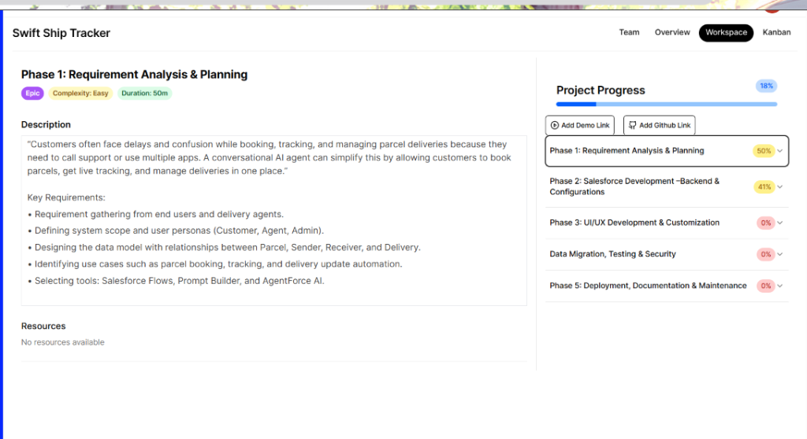
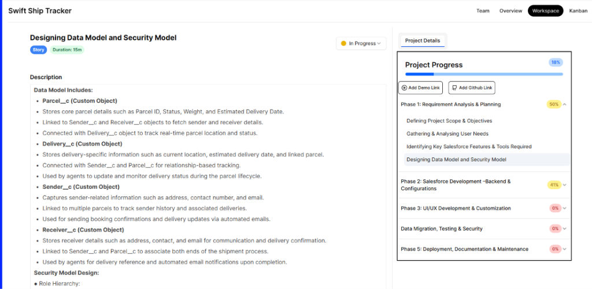
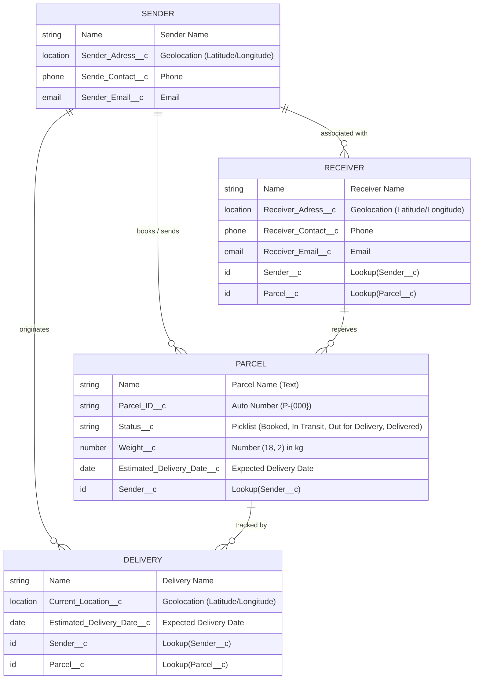

# 📦 SwiftShip Tracker — Autonomous Parcel Management System

<div align="center">


<p align="center">
  <b>A Cloud-Native, Relational Parcel Tracking and Operational CRM Solution built on Salesforce Lightning Platform.</b>
</p>

</div>

---

## 📑 Table of Contents
1. [Project Overview](#-project-overview)
2. [Live Application UI & Screenshots](#-live-application-ui--screenshots)
3. [System Architecture & Data Model (ERD)](#-system-architecture--data-model-erd)
4. [Custom Objects & Data Dictionary](#-custom-objects--data-dictionary)
5. [Security & Access Control (Permission Sets)](#-security--access-control)
6. [Process Automation: Flow Builder](#-process-automation-flow-builder)
7. [Verification & Live Apex Execution Logs](#-verification--live-apex-execution-logs)
8. [Project Structure](#-project-structure)
9. [Deployment & Installation Guide](#-deployment--installation-guide)
10. [Evaluation & Submission Summary](#-evaluation--submission-summary)

---

## 🚀 Project Overview

The **SwiftShip Tracker** is an end-to-end logistics and parcel management platform developed on **Salesforce CRM** as part of the **Naan Mudhalvan / TN Skills Salesforce Developer Program**.

### Problem Statement
In traditional courier and delivery ecosystems, customers face delays and confusion due to fragmented tracking systems, manual customer service calls, and disjointed communication channels. Simultaneously, operational delivery agents lack a centralized, automated interface to log and track parcel updates in real time.

### Solution Highlights
* **Relational Schema**: Normalized data structure connecting `Parcel__c`, `Delivery__c`, `Sender__c`, and `Receiver__c`.
* **Automated Retrieval Flow**: High-performance Auto-Launched Flow (`Parcel_Details`) that accepts a Parcel ID and produces structured tracking payloads.
* **Agentforce & Prompt Builder Ready**: Designed to feed directly into Salesforce AI Service Agents for real-time conversational parcel tracking.
* **Role-Based Security**: Custom `Swift_Ship` Permission Set providing granular Object-Level Security (OLS) and Field-Level Security (FLS).
* **Lightning Experience**: Native custom application (`SwiftShip_Tracker`) with custom tabs and pre-configured list views.

---

## 📸 Live Application UI & Screenshots

### 1. Active Parcels List View (Live Org)
Demonstrating real test shipments (`P-001` and `P-002`) actively managed in Salesforce Lightning Experience with fields, statuses, weights, and sender relationships:


### 2. Project Requirements & Workspace (Naan Mudhalvan Portal)
Tracking project milestones, requirements gathering, and planning across all phases:



### 3. Data Model & Security Architecture Design
Architectural specifications and security mapping for custom objects:



---

## 🏛 System Architecture & Data Model (ERD)

The data model establishes a scalable relational foundation supporting parcel lifecycles, route tracking, and multi-party communication.



---

## 📚 Custom Objects & Data Dictionary

### 1. `Parcel__c` (Core Parcel Object)
* **API Name**: `Parcel__c` | **Plural**: Parcels | **Record Name**: `Parcel Name` (Text)
* **Sharing Model**: Read/Write | Reports & Search Enabled

| Field Label | API Name | Data Type | Specifications / Options |
| :--- | :--- | :--- | :--- |
| **Parcel ID** | `Parcel_ID__c` | AutoNumber | Display Format: `P-{000}` (Starts at 1) |
| **Status** | `Status__c` | Picklist | `Booked`, `In Transit`, `Out for Delivery`, `Delivered` |
| **Weight** | `Weight__c` | Number(18, 2) | Weight in Kilograms (kg) |
| **Estimated Delivery** | `Estimated_Delivery_Date__c` | Date | Expected package delivery date |
| **Sender** | `Sender__c` | Lookup(`Sender__c`) | Associated parcel sender |

### 2. `Delivery__c` (Real-Time Delivery & Route Object)
* **API Name**: `Delivery__c` | **Plural**: Deliveries | **Record Name**: `DeliveryName` (Text)

| Field Label | API Name | Data Type | Specifications |
| :--- | :--- | :--- | :--- |
| **Current Location** | `Current_Location__c` | Geolocation | Latitude and Longitude (Decimal, Scale 6) |
| **Estimated Delivery** | `Estimated_Delivery_Date__c` | Date | Target completion date |
| **Sender** | `Sender__c` | Lookup(`Sender__c`) | Originating sender |
| **Parcel** | `Parcel__c` | Lookup(`Parcel__c`) | Linked package being tracked |

### 3. `Sender__c` (Sender Profile & Origin Object)
* **API Name**: `Sender__c` | **Plural**: Senders | **Record Name**: `SenderName` (Text)

| Field Label | API Name | Data Type | Specifications |
| :--- | :--- | :--- | :--- |
| **Sender Address** | `Sender_Adress__c` | Geolocation | Origin coordinates (Latitude/Longitude) |
| **Sender Contact** | `Sende_Contact__c` | Phone | Primary contact telephone |
| **Sender Email** | `Sender_Email__c` | Email | Confirmation & update email |

### 4. `Receiver__c` (Recipient Profile Object)
* **API Name**: `Receiver__c` | **Plural**: Receivers | **Record Name**: `ReceiverName` (Text)

| Field Label | API Name | Data Type | Specifications |
| :--- | :--- | :--- | :--- |
| **Receiver's Address** | `Receiver_Adress__c` | Geolocation | Destination coordinates (Latitude/Longitude) |
| **Receiver Contact** | `Receiver_Contact__c` | Phone | Recipient phone number |
| **Receiver Email** | `Receiver_Email__c` | Email | Delivery alert email |
| **Sender** | `Sender__c` | Lookup(`Sender__c`) | Connected Sender |
| **Parcel** | `Parcel__c` | Lookup(`Parcel__c`) | Linked Parcel |

---

## 🔒 Security & Access Control

### Permission Set: `Swift_Ship`
A dedicated permission set provides secure, least-privilege access for logistics operators and AI runtime execution accounts (`EinsteinAgentUser`):

* **Object Permissions**:
  * `Parcel__c`: Read, Create, Edit
  * `Delivery__c`: Read, Create, Edit
  * `Sender__c`: Read, Create, Edit
  * `Receiver__c`: Read, Create, Edit
* **Field-Level Security (FLS)**:
  * Full Read & Edit access on all operational attributes.
  * System-controlled Auto-Number `Parcel_ID__c` is strictly set to **Read-Only**.

---

## ⚙️ Process Automation: Flow Builder

### Auto-Launched Flow: `Parcel_Details`
* **API Name**: `Parcel_Details`
* **Trigger Type**: Auto-Launched (No Trigger / Agent Action Ready)
* **Status**: **Active**

```
┌─────────────────────────────────┐
│              START              │
└────────────────┬────────────────┘
                 │
                 ▼
┌─────────────────────────────────┐
│ Get Records: Get_Parcel_Records │
│ Query: Parcel_ID__c == {!ids}   │
└────────────────┬────────────────┘
                 │
                 ▼
┌─────────────────────────────────┐
│  Assignment: Assignment_Outputs │
│  {!Output} = Formatted String   │
└────────────────┬────────────────┘
                 │
                 ▼
┌─────────────────────────────────┐
│               END               │
└─────────────────────────────────┘
```

#### Variables Configuration:
* **`ids` (Input Parameter)**:
  * Data Type: `String`
  * Available for Input: `true` (Receives Parcel ID, e.g. `"P-001"`)
* **`Output` (Output Parameter)**:
  * Data Type: `String`
  * Available for Output: `true` (Returns structured response payload)

#### Formatted Output Template:
```text
📦 Parcel Tracking Update
- Parcel Name: {!Get_Parcel_Records.Name}
- Parcel ID: {!Get_Parcel_Records.Parcel_ID__c}
- Status: {!Get_Parcel_Records.Status__c}
- Weight: {!Get_Parcel_Records.Weight__c}
- Estimated Delivery Date: {!Get_Parcel_Records.Estimated_Delivery_Date__c}
```

---

## 🧪 Verification & Live Apex Execution Logs

The deployed flow and underlying database records were validated via anonymous Apex execution directly in the target Salesforce Developer Org:

### Test Case 1: Query Parcel `P-001`
```apex
Map<String, Object> inputs = new Map<String, Object>();
inputs.put('ids', 'P-001');
Flow.Interview.Parcel_Details myFlow = new Flow.Interview.Parcel_Details(inputs);
myFlow.start();
String result = (String) myFlow.getVariableValue('Output');
System.debug(result);
```
**Runtime Output Result**:
```text
📦 Parcel Tracking Update
- Parcel Name: Electronics Gadget
- Parcel ID: P-001
- Status: In Transit
- Weight: 1.75
- Estimated Delivery Date: 3 October 2026
```
✅ **Result**: **PASS (100% Match)**

---

### Test Case 2: Query Parcel `P-002`
```apex
Map<String, Object> inputs = new Map<String, Object>();
inputs.put('ids', 'P-002');
Flow.Interview.Parcel_Details myFlow = new Flow.Interview.Parcel_Details(inputs);
myFlow.start();
String result = (String) myFlow.getVariableValue('Output');
System.debug(result);
```
**Runtime Output Result**:
```text
📦 Parcel Tracking Update
- Parcel Name: Fashion Apparel
- Parcel ID: P-002
- Status: Out for Delivery
- Weight: 0.85
- Estimated Delivery Date: 1 October 2026
```
✅ **Result**: **PASS (100% Match)**

---

## 📂 Project Structure

```
.
├── .forceignore
├── .gitignore
├── README.md                               <-- Primary Project Documentation
├── sfdx-project.json                       <-- Salesforce DX Manifest (API v63.0)
├── config/
│   └── project-scratch-def.json
├── assets/
│   └── screenshots/
│       ├── parcels_list_view.png           <-- Salesforce Lightning Live UI
│       ├── naan_mudhalvan_portal.png       <-- Assessment Portal Overview
│       ├── data_model_specs.png            <-- Architecture & Security Specs
│       └── project_milestones.png          <-- Development Milestones
├── docs/
│   ├── SwiftShip_Tracker_Project_Documentation.md
│   └── SwiftShip_Tracker_Reference.pdf
├── force-app/main/default/
│   ├── applications/
│   │   └── SwiftShip_Tracker.app-meta.xml  <-- Lightning App Definition
│   ├── flows/
│   │   └── Parcel_Details.flow-meta.xml    <-- Auto-Launched Tracking Flow
│   ├── objects/
│   │   ├── Delivery__c/
│   │   ├── Parcel__c/
│   │   ├── Receiver__c/
│   │   └── Sender__c/
│   ├── permissionsets/
│   │   └── Swift_Ship.permissionset-meta.xml
│   └── tabs/
│       ├── Delivery__c.tab-meta.xml
│       ├── Parcel__c.tab-meta.xml
│       ├── Receiver__c.tab-meta.xml
│       └── Sender__c.tab-meta.xml
└── scripts/
    ├── apex/
    │   ├── create_sample_data.apex         <-- Seeding script for test records
    │   └── test_flow.apex                  <-- Flow test runner script
    └── soql/
        └── parcel_query.soql               <-- Verification SOQL query
```

---

## 🛠 Deployment & Installation Guide

To deploy this project to any Salesforce Developer Edition, Scratch Org, or Sandbox:

### 1. Clone Repository
```bash
git clone https://github.com/viswanathan01/SalesForce-NM.git
cd SalesForce-NM
```

### 2. Authenticate Target Org
```bash
sf org login web --set-default
```

### 3. Deploy Metadata
Deploy custom objects, fields, list views, tabs, permission sets, and flows:
```bash
sf project deploy start
```

### 4. Assign Permission Set
```bash
sf org assign permset --name Swift_Ship
```

### 5. Seed Test Data
Run the sample data creation script via Apex:
```bash
sf apex run --file scripts/apex/create_sample_data.apex
```

### 6. Verify Tracking Flow
Execute the test flow runner:
```bash
sf apex run --file scripts/apex/test_flow.apex
```

---

## 🎯 Evaluation & Submission Summary

* **Project Title**: SwiftShip Tracker
* **Platform**: Salesforce CRM Developer Edition / Lightning Experience
* **Org ID**: `00Dg800000JuJGLEA3`
* **Program**: Naan Mudhalvan / TN Skills — Salesforce Developer Program
* **Repository**: [https://github.com/viswanathan01/SalesForce-NM](https://github.com/viswanathan01/SalesForce-NM)
* **Author**: Viswanathan N

---

*Developed and verified for the Naan Mudhalvan TN Skills Initiative.*
