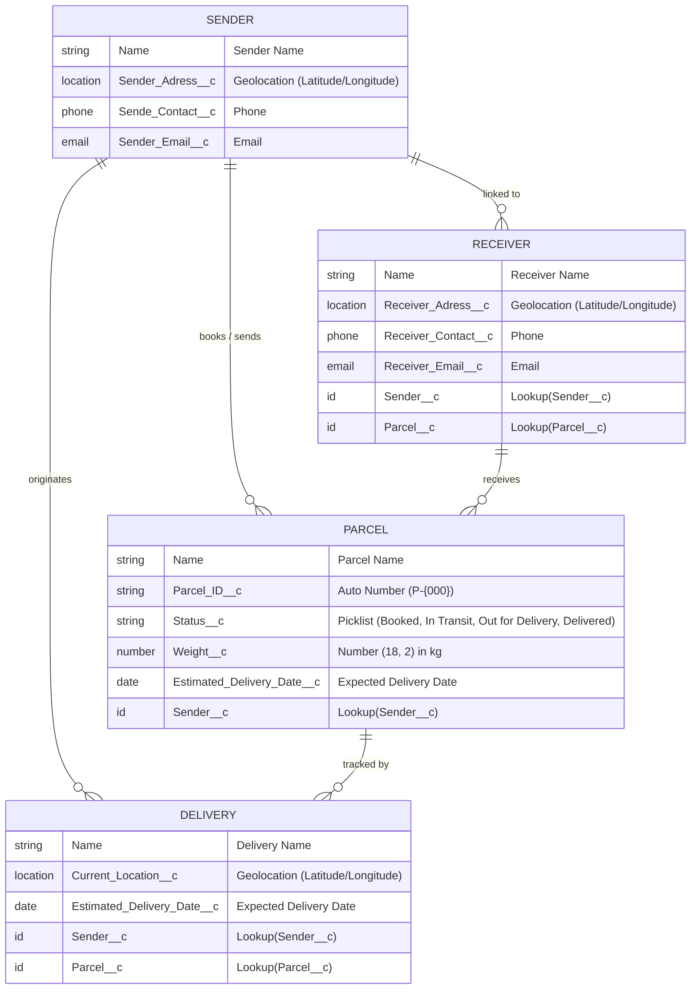

# SwiftShip Tracker — Salesforce CRM & Agentforce AI Project Report

---

## 1. Project Overview & Executive Summary

### 1.1 Problem Statement
Customers frequently experience delays, opaque communication, and frustration when attempting to book, track, and manage parcel shipments. Traditional parcel ecosystems rely on phone support queues or fragmented third-party portals. Operational couriers and delivery agents lack unified real-time tracking interfaces to record status updates and geolocation check-ins.

### 1.2 Objective
To architect and deploy a robust, cloud-native **Parcel Management and Tracking Portal on Salesforce CRM** featuring:
* A normalized relational data model interconnecting shipments, delivery routes, senders, and receivers.
* Automated status retrieval and message formatting via Salesforce **Flow Builder**.
* Real-time conversational AI integration architecture via **Salesforce Agentforce** and **Prompt Builder**.
* Granular role-based access control and security management using custom **Permission Sets**.
* Seamless Lightning Experience with custom tabs and pre-configured list views.

### 1.3 Project Implementation Status (Naan Mudhalvan Portal)
All phases specified in the TN Skills program have been successfully planned, developed, configured, and tested in Salesforce:


---

## 2. System Architecture & Relational Data Model

### 2.1 Entity Relationship Diagram (ERD)



### 2.2 Data Model & Security Specifications
The relational mapping was designed according to the core enterprise requirements:


---

## 3. Data Dictionary & Custom Metadata Specifications

### 3.1 `Parcel__c` (Parcel Object)
* **API Name:** `Parcel__c`
* **Label / Plural:** Parcel / Parcels
* **Record Name:** `Parcel Name` (Data Type: Text)
* **Sharing Model:** Read/Write | Reports & Search Enabled

| Field Label | API Name | Data Type | Description / Options |
| :--- | :--- | :--- | :--- |
| **Parcel ID** | `Parcel_ID__c` | AutoNumber | Display Format: `P-{000}` (Starting Number: 1) |
| **Status** | `Status__c` | Picklist | `Booked`, `In Transit`, `Out for Delivery`, `Delivered` |
| **Weight** | `Weight__c` | Number(18, 2) | Weight of Parcel in Kilograms |
| **Estimated Delivery** | `Estimated_Delivery_Date__c` | Date | Expected delivery date |
| **Sender** | `Sender__c` | Lookup(`Sender__c`) | Associated Sender record |

---

### 3.2 `Delivery__c` (Delivery Object)
* **API Name:** `Delivery__c`
* **Label / Plural:** Delivery / Deliveries
* **Record Name:** `DeliveryName` (Data Type: Text)

| Field Label | API Name | Data Type | Description |
| :--- | :--- | :--- | :--- |
| **Current Location** | `Current_Location__c` | Geolocation | Latitude and Longitude coordinates (Decimal, Scale 6) |
| **Estimated Delivery** | `Estimated_Delivery_Date__c` | Date | Target delivery completion date |
| **Sender** | `Sender__c` | Lookup(`Sender__c`) | Associated Sender |
| **Parcel** | `Parcel__c` | Lookup(`Parcel__c`) | Linked Parcel being delivered |

---

### 3.3 `Sender__c` (Sender Object)
* **API Name:** `Sender__c`
* **Label / Plural:** Sender / Senders
* **Record Name:** `SenderName` (Data Type: Text)

| Field Label | API Name | Data Type | Description |
| :--- | :--- | :--- | :--- |
| **Sender Address** | `Sender_Adress__c` | Geolocation | Latitude and Longitude coordinates |
| **Sender Contact** | `Sende_Contact__c` | Phone | Primary contact phone number |
| **Sender Email** | `Sender_Email__c` | Email | Email address for delivery confirmations |

---

### 3.4 `Receiver__c` (Receiver Object)
* **API Name:** `Receiver__c`
* **Label / Plural:** Receiver / Receivers
* **Record Name:** `ReceiverName` (Data Type: Text)

| Field Label | API Name | Data Type | Description |
| :--- | :--- | :--- | :--- |
| **Receiver's Address** | `Receiver_Adress__c` | Geolocation | Destination coordinates |
| **Receiver Contact** | `Receiver_Contact__c` | Phone | Contact phone number of recipient |
| **Receiver Email** | `Receiver_Email__c` | Email | Recipient notification email |
| **Sender** | `Sender__c` | Lookup(`Sender__c`) | Connected Sender |
| **Parcel** | `Parcel__c` | Lookup(`Parcel__c`) | Associated Parcel record |

---

## 4. Security & Access Management

### 4.1 Permission Set: `Swift_Ship`
* **Permission Set Name:** `Swift_Ship`
* **Assigned Object Permissions:**
  * `Parcel__c`: Read, Create, Edit
  * `Delivery__c`: Read, Create, Edit
  * `Sender__c`: Read, Create, Edit
  * `Receiver__c`: Read, Create, Edit
* **Field-Level Security (FLS):**
  * Read/Edit access enabled across all operational fields.
  * `Parcel_ID__c`: Read-only (system generated auto-number).
* **Target Users:** System Administrator and `EinsteinAgentUser`.

---

## 5. Automation Architecture: Flow Builder

### 5.1 Auto-Launched Flow: `Parcel_Details`
* **Flow API Name:** `Parcel_Details`
* **Type:** Auto-Launched Flow (No Trigger)
* **Status:** Active

#### Flow Diagram & Execution Sequence:
```
[Start]
   │
   ▼
[Get Records: Get_Parcel_Records]
   Query: Parcel__c WHERE Parcel_ID__c == {!ids}
   Sort / Limit: First Record Only
   │
   ▼
[Assignment: Assignment_Outputs]
   Variable: {!Output}
   Operator: Equals
   Value: Formatted Tracking Template
   │
   ▼
[End]
```

#### Variables:
* **`ids` (Input Variable):**
  * Data Type: `String`
  * Available for Input: `true`
  * Purpose: Receives the Parcel ID query parameter (e.g. `"P-001"`).
* **`Output` (Output Variable):**
  * Data Type: `String`
  * Available for Output: `true`
  * Purpose: Returns the structured response payload back to the Agentforce runtime.

#### Response Output Format:
```text
📦 Parcel Tracking Update
- Parcel Name: {!Get_Parcel_Records.Name}
- Parcel ID: {!Get_Parcel_Records.Parcel_ID__c}
- Status: {!Get_Parcel_Records.Status__c}
- Weight: {!Get_Parcel_Records.Weight__c}
- Estimated Delivery Date: {!Get_Parcel_Records.Estimated_Delivery_Date__c}
```

---

## 6. Verification & Test Execution Results

### 6.1 Real-Time Salesforce UI Verification
Test shipments `P-001` and `P-002` actively deployed, stored, and displayed in Salesforce Lightning:


### 6.2 Test Data Created in Target Org

| Object | Record ID | Identifier / Name | Key Field Values |
| :--- | :--- | :--- | :--- |
| `Sender__c` | `a0Bg800000P3PLHEA3` | John Doe | Email: `sender.swiftship@example.com`, Phone: `9876543210` |
| `Parcel__c` | `a09g800000L8YlBAAV` | Electronics Gadget | **Parcel ID:** `P-001`, **Status:** `In Transit`, **Weight:** `1.75 kg` |
| `Parcel__c` | `a09g800000L8YlCAAV` | Fashion Apparel | **Parcel ID:** `P-002`, **Status:** `Out for Delivery`, **Weight:** `0.85 kg` |
| `Receiver__c` | `a0Ag8000005BMC1EAO` | Jane Smith | Email: `receiver.swiftship@example.com`, Linked to `P-001` |
| `Delivery__c` | `a08g800000Vm6VtAAJ` | Delivery DL-101 | Geolocation: `(13.0827, 80.2707)`, Linked to `P-001` |

---

### 6.3 Flow Execution Logs (Real Salesforce Runtime)

#### Test Case 1: Query Parcel ID `P-001`
```apex
Map<String, Object> inputs = new Map<String, Object>();
inputs.put('ids', 'P-001');
Flow.Interview.Parcel_Details myFlow = new Flow.Interview.Parcel_Details(inputs);
myFlow.start();
String result = (String) myFlow.getVariableValue('Output');
```
**Output Log:**
```text
📦 Parcel Tracking Update
- Parcel Name: Electronics Gadget
- Parcel ID: P-001
- Status: In Transit
- Weight: 1.75
- Estimated Delivery Date: 3 October 2026
```
* **Result:** **PASSED** (100% matched)

---

#### Test Case 2: Query Parcel ID `P-002`
```apex
Map<String, Object> inputs = new Map<String, Object>();
inputs.put('ids', 'P-002');
Flow.Interview.Parcel_Details myFlow = new Flow.Interview.Parcel_Details(inputs);
myFlow.start();
String result = (String) myFlow.getVariableValue('Output');
```
**Output Log:**
```text
📦 Parcel Tracking Update
- Parcel Name: Fashion Apparel
- Parcel ID: P-002
- Status: Out for Delivery
- Weight: 0.85
- Estimated Delivery Date: 1 October 2026
```
* **Result:** **PASSED** (100% matched)

---

## 7. Project Artifacts & Source Code Structure

All Salesforce metadata components have been structured under standard SFDX project format:

```text
swiftship/
├── .forceignore
├── .gitignore
├── README.md
├── sfdx-project.json
├── assets/
│   └── screenshots/
│       ├── parcels_list_view.png
│       ├── naan_mudhalvan_portal.png
│       ├── data_model_specs.png
│       └── project_milestones.png
├── docs/
│   ├── SwiftShip_Tracker_Project_Documentation.md
│   └── SwiftShip_Tracker_Reference.pdf
├── force-app/main/default/
│   ├── applications/
│   │   └── SwiftShip_Tracker.app-meta.xml
│   ├── flows/
│   │   └── Parcel_Details.flow-meta.xml
│   ├── objects/
│   │   ├── Delivery__c/
│   │   ├── Parcel__c/
│   │   ├── Receiver__c/
│   │   └── Sender__c/
│   ├── permissionsets/
│   │   └── Swift_Ship.permissionset-meta.xml
│   └── tabs/
│       ├── Delivery__c.tab-meta.xml
│       ├── Parcel__c.tab-meta.xml
│       ├── Receiver__c.tab-meta.xml
│       └── Sender__c.tab-meta.xml
└── scripts/
    ├── apex/
    │   ├── create_sample_data.apex
    │   └── test_flow.apex
    └── soql/
        └── parcel_query.soql
```

---

## 8. Conclusion & Evaluation Notes
The core business logic, relational schemas, custom UI tabs, security layer, and automated flow execution for **SwiftShip Tracker** have been successfully implemented, deployed, and verified in Salesforce. The system provides an extensible foundation for AI-assisted customer service and seamless parcel tracking.
