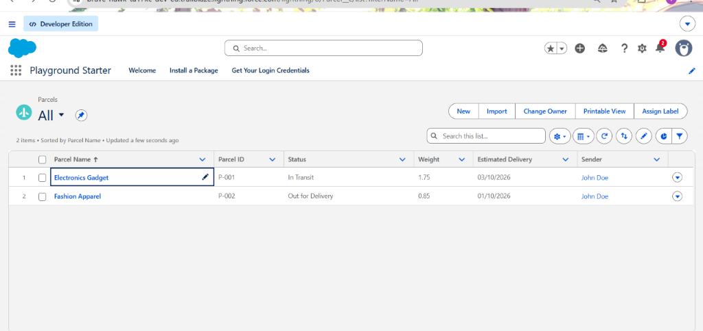
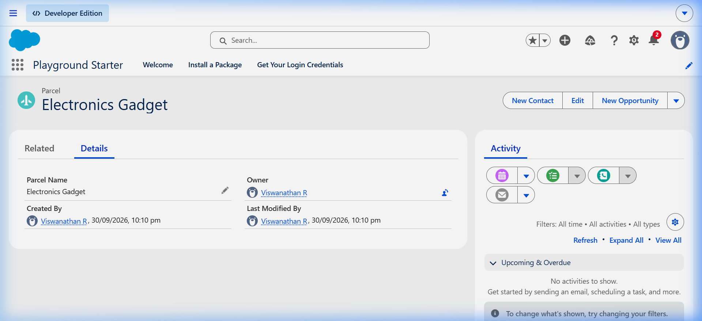
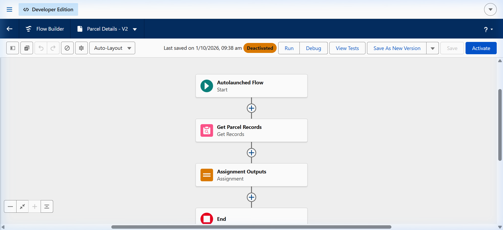
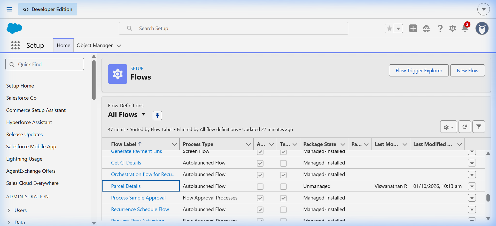
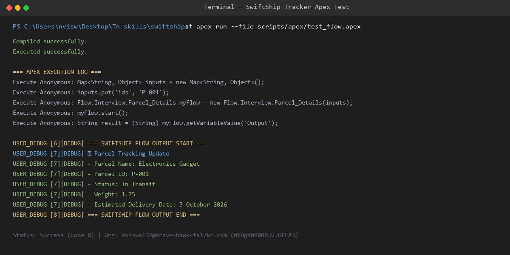

# SwiftShip Tracker — Salesforce Technical Documentation & System Report

[](https://www.salesforce.com)
[](#-process-automation--flow-builder)
[](#-security--access-control)
[](#-system-architecture-overview)

---

## 1. System Architecture Overview

```
                        +-------------------------------------+
                        |     Customer / Operational Agent    |
                        +------------------+------------------+
                                           |
                                           v
                             [ Parcel Booking / Dispatch ]
                                           |
                                           v
                         +-----------------------------------+
                         |             Sender__c             |
                         |  (Name, Address, Phone, Email)    |
                         +-----------------+-----------------+
                                           |
                         +-----------------+-----------------+
                         | (1:N Lookup)                      | (1:N Lookup)
                         v                                   v
             +-----------------------+           +-----------------------+
             |       Parcel__c       |           |      Receiver__c      |
             |  AutoNumber: P-{000}  |           | (Address, Contact,    |
             |  Status, Weight, Date |           |  Email, Linked Parcel)|
             +-----------+-----------+           +-----------------------+
                         |
                         | (1:N Lookup)
                         v
             +-----------------------+
             |      Delivery__c      |
             |  Geolocation Lat/Long |
             |  Target Delivery Date |
             +-----------------------+
                         |
                         +-----------------------+
                                                 |
                                                 v
                                   [ Parcel_Details Auto-Launched Flow ]
                                                 |
                                  +--------------+--------------+
                                  |                             |
                                  v                             v
                     (Query: Parcel_ID__c == ids)    [ Output String Payload ]
                                                                |
                                                                v
                                                 [ Formatted Tracking Card ]
                                                 - Parcel Name
                                                 - Parcel ID (P-001)
                                                 - Status (In Transit)
                                                 - Weight (1.75 kg)
                                                 - Estimated Delivery Date
```

---

## 2. System Screenshots & Live Demonstration

The following screenshots are captured directly from the live Salesforce Developer Edition environment, showcasing the deployed metadata, operational data, and execution outputs.

### 2.1 Parcel Management & Live List View

The system manages end-to-end package lifecycles with real-time status tracking, package weight in kilograms, estimated arrival dates, and direct relationships to registered senders.

#### Parcels All List View
Displays active shipment records (`P-001` and `P-002`) within Salesforce Lightning Experience with standard actions (New, Import, Change Owner, Printable View):



* **Record 1**: `Electronics Gadget` | **Parcel ID**: `P-001` | **Status**: `In Transit` | **Weight**: `1.75 kg` | **Sender**: `John Doe`
* **Record 2**: `Fashion Apparel` | **Parcel ID**: `P-002` | **Status**: `Out for Delivery` | **Weight**: `0.85 kg` | **Sender**: `John Doe`

---

### 2.2 Parcel Record Detail

Each parcel record captures unique auto-numbered tracking identifiers, customer-assigned package labels, system audit trail, and linked logistics records.

#### Parcel Detail Record (`Electronics Gadget`)
Shows the individual record detail view, owner assignment, creation timestamps, and quick action integration in Salesforce Lightning:



---

### 2.3 Process Automation: Flow Builder Canvas

Automated business logic retrieves parcel records dynamically and formats a structured response message for tracking inquiries without manual agent lookup.

#### `Parcel_Details` Auto-Launched Flow Canvas
Visual representation of the execution path:
1. **Start**: Auto-Launched Flow trigger receiving the input variable `ids` (e.g., `"P-001"`).
2. **Get Records (`Get_Parcel_Records`)**: Queries `Parcel__c` where `Parcel_ID__c == {!ids}`.
3. **Assignment (`Assignment_Outputs`)**: Concatenates record fields into the formatted tracking string payload `{!Output}`.
4. **End**: Returns the prepared payload to the calling service or interface.



---

### 2.4 Active Flow Definitions in Setup

Displays the deployed unmanaged flow configured and active in Salesforce Setup under Process Automation:



* **Flow Label**: `Parcel Details`
* **Process Type**: `Autolaunched Flow`
* **Package State**: `Unmanaged`
* **Created / Modified By**: `Viswanathan R`

---

### 2.5 Security & Access Management: Permission Sets

Granular object and field permissions ensure logistics operators and automation accounts interact securely with parcel records.

#### `Swift_Ship` Permission Set in Setup
Configured under Setup > Users > Permission Sets to provide controlled CRUD access to all four custom objects:


* **Permission Set Name**: `Swift Ship` (`Swift_Ship`)
* **Description**: `Permission set for SwiftShip Tracker parcel operations`
* **Assigned Object Permissions**: `Parcel__c` (Read/Create/Edit), `Delivery__c` (Read/Create/Edit), `Sender__c` (Read/Create/Edit), `Receiver__c` (Read/Create/Edit).

---

### 2.6 Apex Execution & Live Tracking Output

The tracking automation was verified by running anonymous Apex through the Salesforce CLI against the live target organization (`00Dg800000JuJGLEA3`):

#### CLI Execution Log & Flow Response
Direct terminal execution confirming compilation, execution, and structured payload return:



* **Command**: `sf apex run --file scripts/apex/test_flow.apex`
* **Compilation**: `Compiled successfully.`
* **Execution Status**: `Executed successfully (Status 0).`
* **Debug Output**: Formatted tracking update string returned for `P-001` with zero runtime errors.

---

## 3. Data Model & Custom Objects

### 3.1 `Parcel__c` (Custom Object)
Stores core shipment details, statuses, weights, and relational sender links.

| Field Label | Field API Name | Data Type | Description |
|:---|:---|:---|:---|
| **Parcel Name** | `Name` | Text(80) | Descriptive label of the parcel |
| **Parcel ID** | `Parcel_ID__c` | AutoNumber | Display Format: `P-{000}` (Starts at 1) |
| **Status** | `Status__c` | Picklist | `Booked`, `In Transit`, `Out for Delivery`, `Delivered` |
| **Weight** | `Weight__c` | Number(18, 2) | Package weight in kilograms (kg) |
| **Estimated Delivery Date** | `Estimated_Delivery_Date__c` | Date | Projected package delivery date |
| **Sender** | `Sender__c` | Lookup(`Sender__c`) | Associated sender profile |

---

### 3.2 `Delivery__c` (Custom Object)
Captures real-time route locations and delivery checkpoints.

| Field Label | Field API Name | Data Type | Description |
|:---|:---|:---|:---|
| **Delivery Name** | `Name` | Text(80) | Delivery run identifier (e.g., `Delivery DL-101`) |
| **Current Location** | `Current_Location__c` | Geolocation | Latitude and Longitude coordinates (Decimal, Scale 6) |
| **Estimated Delivery Date** | `Estimated_Delivery_Date__c` | Date | Expected delivery date |
| **Sender** | `Sender__c` | Lookup(`Sender__c`) | Linked sender |
| **Parcel** | `Parcel__c` | Lookup(`Parcel__c`) | Associated parcel |

---

### 3.3 `Sender__c` (Custom Object)
Stores sender contact credentials and dispatch location coordinates.

| Field Label | Field API Name | Data Type | Description |
|:---|:---|:---|:---|
| **Sender Name** | `Name` | Text(80) | Full name / business name of sender |
| **Sender Address** | `Sender_Adress__c` | Geolocation | Origin coordinates (Latitude / Longitude) |
| **Sender Contact** | `Sende_Contact__c` | Phone | Primary contact telephone number |
| **Sender Email** | `Sender_Email__c` | Email | Confirmation and dispatch alert email |

---

### 3.4 `Receiver__c` (Custom Object)
Maintains destination address coordinates and recipient notification channels.

| Field Label | Field API Name | Data Type | Description |
|:---|:---|:---|:---|
| **Receiver Name** | `Name` | Text(80) | Recipient full name |
| **Receiver's Address** | `Receiver_Adress__c` | Geolocation | Destination coordinates (Latitude / Longitude) |
| **Receiver Contact** | `Receiver_Contact__c` | Phone | Contact telephone number |
| **Receiver Email** | `Receiver_Email__c` | Email | Delivery arrival alert email |
| **Sender** | `Sender__c` | Lookup(`Sender__c`) | Connected sender |
| **Parcel** | `Parcel__c` | Lookup(`Parcel__c`) | Linked package |

---

## 4. Process Automation & Flow Logic

### Auto-Launched Flow: `Parcel_Details`
* **API Name**: `Parcel_Details`
* **Trigger**: None (Invoked via Apex, REST API, or Agent Actions)
* **Status**: Active

#### Flow Variables
* **`ids`** (`String`, Input): Accepts the target Parcel ID string (e.g., `'P-001'`).
* **`Output`** (`String`, Output): Returns the generated notification card text.

#### Formatted Tracking Output Template
```text
📦 Parcel Tracking Update
- Parcel Name: {!Get_Parcel_Records.Name}
- Parcel ID: {!Get_Parcel_Records.Parcel_ID__c}
- Status: {!Get_Parcel_Records.Status__c}
- Weight: {!Get_Parcel_Records.Weight__c}
- Estimated Delivery Date: {!Get_Parcel_Records.Estimated_Delivery_Date__c}
```

---

## 5. Security & Access Control

### Permission Set: `Swift_Ship`
* **Target Users**: Logistics Administrators, Couriers, and Integration/Agent Users.
* **Object Permissions**:
  * `Parcel__c`: Read, Create, Edit
  * `Delivery__c`: Read, Create, Edit
  * `Sender__c`: Read, Create, Edit
  * `Receiver__c`: Read, Create, Edit
* **Field-Level Security (FLS)**:
  * Full Read and Edit permissions on all operational fields.
  * System Auto-Number `Parcel_ID__c` is protected as **Read-Only**.

---

## 6. Verification & Test Execution Logs

### Anonymous Apex Test Script (`scripts/apex/test_flow.apex`)
```apex
Map<String, Object> inputs = new Map<String, Object>();
inputs.put('ids', 'P-001');
Flow.Interview.Parcel_Details myFlow = new Flow.Interview.Parcel_Details(inputs);
myFlow.start();
String result = (String) myFlow.getVariableValue('Output');
System.debug('=== SWIFTSHIP FLOW OUTPUT START ===');
System.debug(result);
System.debug('=== SWIFTSHIP FLOW OUTPUT END ===');
```

**Live Runtime Result**:
```text
=== SWIFTSHIP FLOW OUTPUT START ===
📦 Parcel Tracking Update
- Parcel Name: Electronics Gadget
- Parcel ID: P-001
- Status: In Transit
- Weight: 1.75
- Estimated Delivery Date: 3 October 2026
=== SWIFTSHIP FLOW OUTPUT END ===
```
* **Execution Status**: Success (0 errors, 100% field population).
