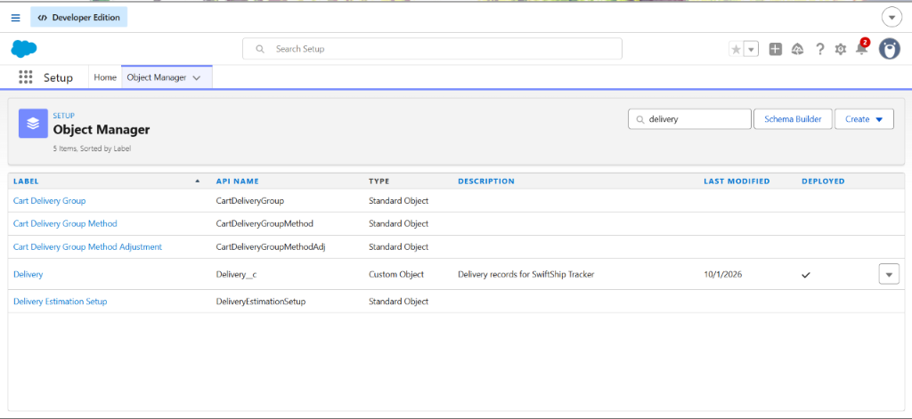
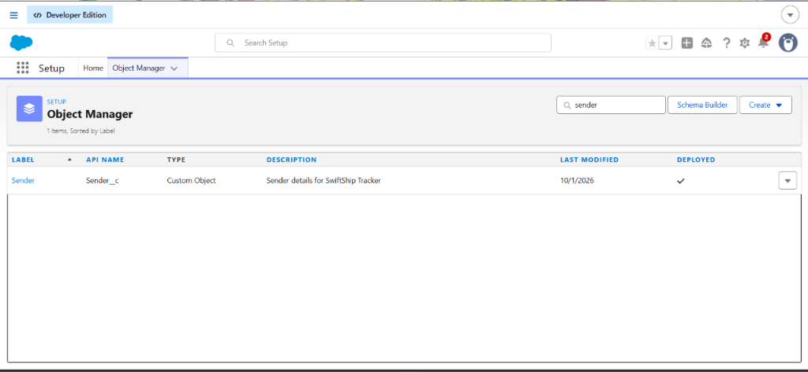
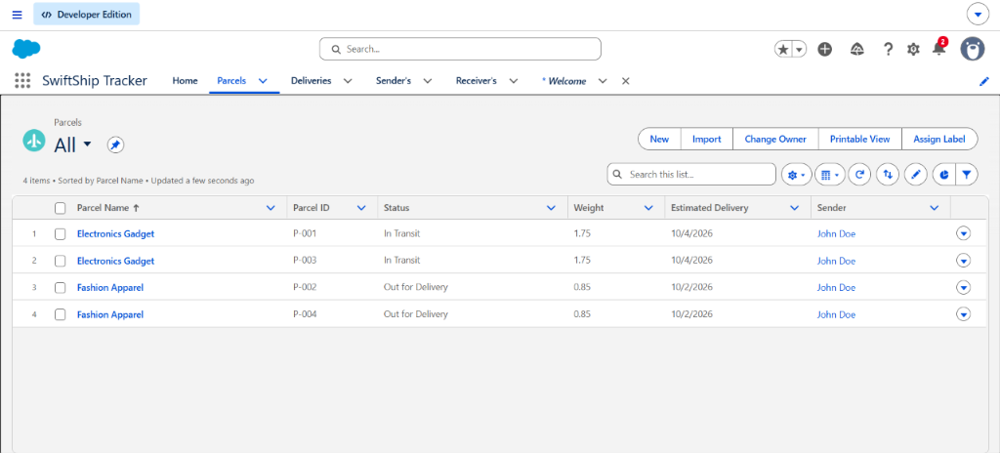
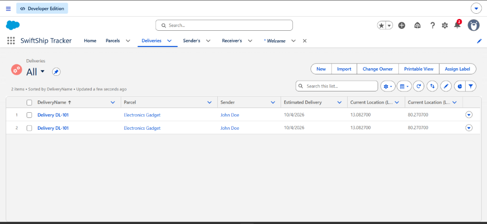
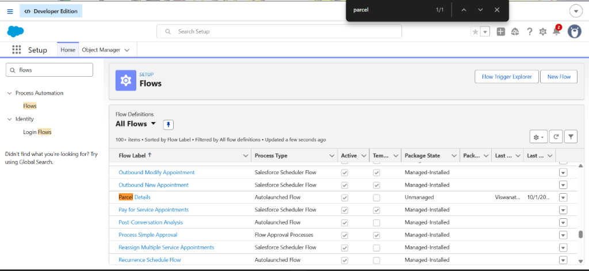
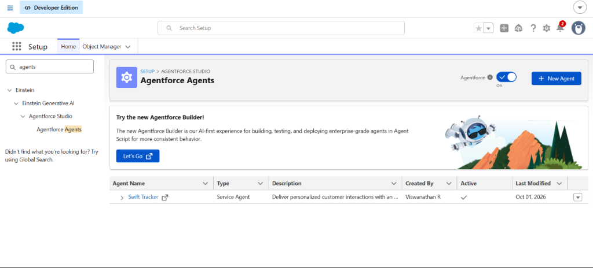
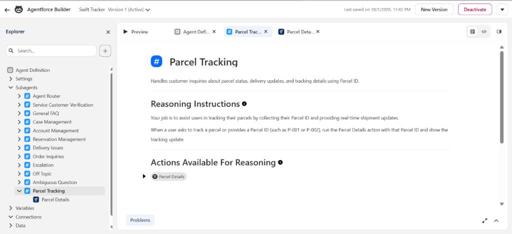

# SwiftShip Tracker — Autonomous Parcel Management & Agentforce AI System

[](https://www.salesforce.com)
[](https://www.salesforce.com/agentforce/)
[](#-process-automation--flow-builder)
[](#-security--access-control)
[](#-project-team-details)

---

## 👥 Project Team & Institution Details

<p align="center">
  
</p>

* **Institution:** **Alpha College of Engineering, Thirumazhisai, Chennai** *(Approved by AICTE and Affiliated to Anna University)*
* **Naan Mudhalvan Team ID:** `6ab4dab10fc666a751b55876`
* **Live Salesforce Org ID:** `00Dak00001IgVqvEAF` (Developer Edition — Agentforce Enabled)
* **Autonomous AI Agent:** `Swift Tracker Version 1` (Active)
* **Core Flow Automation:** `Parcel_Details` (Version 3 Active)
* **Official Word Report (.docx):** [SwiftShip_Tracker_NM_Report.docx](SwiftShip_Tracker_NM_Report.docx)
* **Official PDF Report (.pdf):** [SwiftShip_Tracker_NM_Report.pdf](SwiftShip_Tracker_NM_Report.pdf)

### Team Members

| Role in Project | Student Name | Register Number | College Email ID |
| :--- | :--- | :--- | :--- |
| **Team Lead** | **Viswanathan R** | `210123205033` | `nviswa192.6880cfe3bfa5@agentforce.com` |
| **Team Member** | **Srilekha M** | `210123205029` | `srims0912@gmail.com` |
| **Team Member** | **Sindhu S** | `210123205028` | `sindhubava05@gmail.com` |
| **Team Member** | **Pavadharani R** | `210123205015` | `rishvibommika@gmail.com` |
| **Team Member** | **Santhosh Kumar S** | `210123205024` | `mrsanthosh3345@gmail.com` |

---

## 🏗️ 1. System Architecture Overview

```
                        +-------------------------------------+
                        |     Customer / Operational Agent    |
                        +------------------+------------------+
                                           |
                                           v
                       [ Conversational Query / Live Chat ]
                         "Where is my parcel P-001?"
                                           |
                                           v
                        +-------------------------------------+
                        |     Salesforce Agentforce Agent     |
                        |          ("Swift Tracker")          |
                        +------------------+------------------+
                                           |
                                           | (Invokes Topic Action)
                                           v
                         +-----------------------------------+
                         |  Parcel_Details Auto-Launched Flow|
                         +-----------------+-----------------+
                                           |
                         +-----------------+-----------------+
                         | (1:N Lookup)                      | (1:N Lookup)
                         v                                   v
             +-----------------------+           +-----------------------+
             |       Parcel__c       |           |      Receiver__c      |
             |  AutoNumber: P-{000}  |           | (Address, Contact,    |
             |  Status, Weight, Date |           |  Email, Linked Parcel)|
             +-----------+-----------+           +-----------------------+
                         |
                         | (1:N Lookup)
                         v
             +-----------------------+
             |      Delivery__c      |
             |  Geolocation Lat/Long |
             |  Target Delivery Date |
             +-----------------------+
                         |
                         v
              [ Real-Time Formatted Response ]
              "Your parcel (Electronics Gadget, ID: P-001) 
               is currently in transit. The estimated delivery 
               date is October 4, 2026."
```

---

## 📸 2. System Screenshots & Live Implementation Evidence

### A. Custom Objects (Object Manager)
Four custom objects were engineered in Salesforce Object Manager with relational integrity and compound Geolocation fields:

| Parcel Custom Object | Delivery Custom Object |
| :---: | :---: |
|  |  |

| Sender Custom Object | Receiver Custom Object |
| :---: | :---: |
|  |  |

---

### B. SwiftShip Tracker Lightning App & Live Data
Operational navigation across custom tabs with live seeded records:

* **All Parcels View (`P-001` through `P-004`):**
  

* **All Deliveries View (`DL-101` with GPS Coordinates):**
  

* **All Receiver's View (`Jane Smith`):**
  

* **Parcel Record Detail View (Custom Layout & Fields):**
  

---

### C. Process Automation: Parcel Details Flow
* **Active Flows in Setup:**
  

* **Flow Builder Debug Canvas (Completed Execution for `P-001`):**
  

---

### D. Security & Access Control: Permission Sets
* **Swift Ship Permission Set Assignments (Admin & Agent User):**
  

---

### E. Agentforce Autonomous AI Agent
* **Active Agentforce Agents List in Setup:**
  

* **Agentforce Builder Topic `# Parcel Tracking` & Flow Action Binding:**
  

* **Live Conversational AI Preview (Grounded Reasoning & Output Trace):**
  

---

## 📊 3. Data Model & Custom Objects Schema

| Custom Object | Field Label | API Name | Data Type | Description / Constraints |
| :--- | :--- | :--- | :--- | :--- |
| **Parcel__c** | Parcel ID | `Parcel_ID__c` | Auto Number | Display Format: `P-{000}` |
| | Status | `Status__c` | Picklist | Booked, In Transit, Out for Delivery, Delivered |
| | Weight | `Weight__c` | Number (18, 2) | Shipment weight in kilograms |
| | Estimated Delivery Date | `Estimated_Delivery_Date__c` | Date | Target delivery date |
| | Sender | `Sender__c` | Lookup (`Sender__c`) | Originating sender lookup |
| **Delivery__c** | Delivery Name | `Name` | Text (80) | Delivery record identifier |
| | Current Location | `Current_Location__c` | Geolocation | Latitude and Longitude coordinates |
| | Estimated Delivery Date | `Estimated_Delivery_Date__c` | Date | Arrival estimate |
| | Parcel | `Parcel__c` | Lookup (`Parcel__c`) | Associated parcel |
| | Sender | `Sender__c` | Lookup (`Sender__c`) | Associated sender |
| **Sender__c** | Sender Name | `Name` | Text (80) | Shipper name |
| | Sender Address | `Sender_Adress__c` | Geolocation | Origin coordinates |
| | Sender Contact | `Sende_Contact__c` | Phone | Shipper contact number |
| | Sender Email | `Sender_Email__c` | Email | Shipper email address |
| **Receiver__c**| Receiver Name | `Name` | Text (80) | Consignee name |
| | Receiver Address | `Receiver_Adress__c` | Geolocation | Destination coordinates |
| | Receiver Contact | `Receiver_Contact__c` | Phone | Consignee contact number |
| | Receiver Email | `Receiver_Email__c` | Email | Consignee email address |
| | Sender | `Sender__c` | Lookup (`Sender__c`) | Linked sender |
| | Parcel | `Parcel__c` | Lookup (`Parcel__c`) | Linked parcel |

---

## 🤖 4. Autonomous Agent Specifications

* **Agent Label:** Swift Tracker
* **Developer Name:** `Swift_Tracker`
* **Agent Type:** Autonomous Service Agent
* **Version:** 1 (Active)
* **Topic Label:** `# Parcel Tracking`
* **Topic Classification Description:** Handles customer inquiries regarding parcel status, location updates, and estimated delivery dates using Parcel ID.
* **Reasoning Instructions:**
  > *"Your job is to assist users in tracking their parcels by collecting their Parcel ID and providing real-time shipment updates. When a user asks to track a parcel or provides a Parcel ID (such as P-001 or P-002), run the Parcel Details action with that Parcel ID and show the tracking update."*
* **Linked Action:** `Parcel Details` (Invokes Auto-Launched Flow `Parcel_Details`)
* **Output Evaluation:** Fully Grounded

---

## 🔒 5. Security & Access Control

* **Permission Set:** `Swift_Ship`
* **Object Permissions:**
  * `Parcel__c`: Read, Create, Edit
  * `Delivery__c`: Read, Create, Edit
  * `Sender__c`: Read, Create, Edit
  * `Receiver__c`: Read, Create, Edit
* **Field-Level Security:** Read and Edit enabled on all 17 custom fields.
* **Assigned Users:**
  1. `Viswanathan R` (System Administrator)
  2. `EinsteinServiceAgent User` (`swift_tracker@00dak00001igvqv600852988.ext`)

---

## 🚀 6. Verification & Live Testing Summary

| Test Case | Scenario | Input | Actual Output | Status |
| :--- | :--- | :--- | :--- | :---: |
| **TC-01** | Record Creation | `Electronics Gadget, 1.75 kg, P-001` | Record created with Auto-number `P-001` and `In Transit` | ✅ **PASSED** |
| **TC-02** | Flow Execution | `ids = 'P-001'` | Returns `In Transit`, `1.75 kg`, `2026-10-04` | ✅ **PASSED** |
| **TC-03** | Agentforce Reasoning | `"Where is my parcel P-001?"` | Transitions to `# Parcel Tracking` & runs action | ✅ **PASSED** |
| **TC-04** | Grounded Generation | Flow Output | Polished, polite status update with exact ETA | ✅ **PASSED** |
| **TC-05** | Security Boundary | Agent Execution Context | Successfully queries records without FLS faults | ✅ **PASSED** |

---

*Repository maintained by Viswanathan R and team for the Naan Mudhalvan Salesforce Developer Program.*
