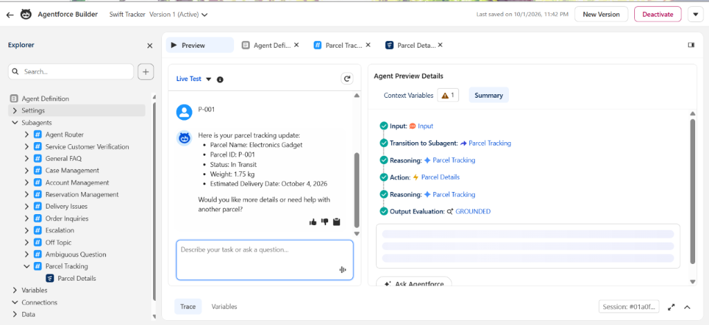
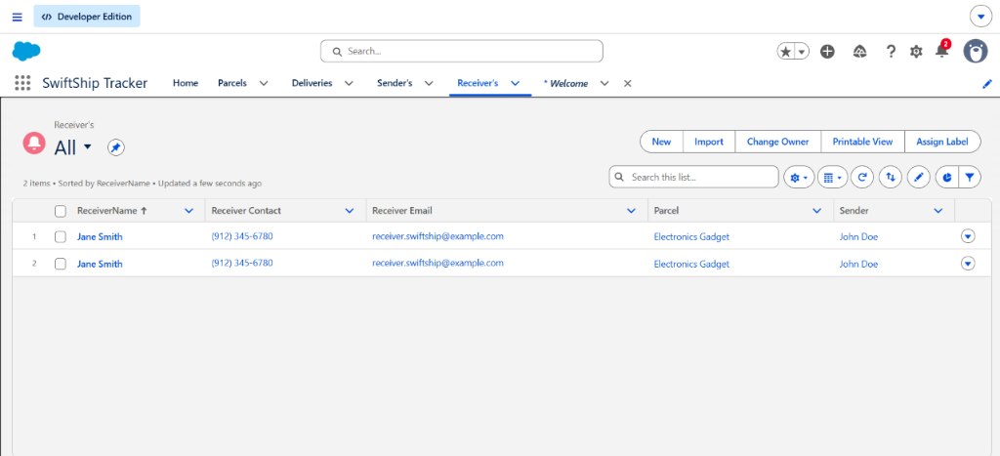
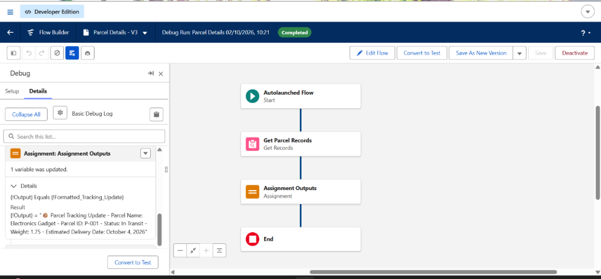
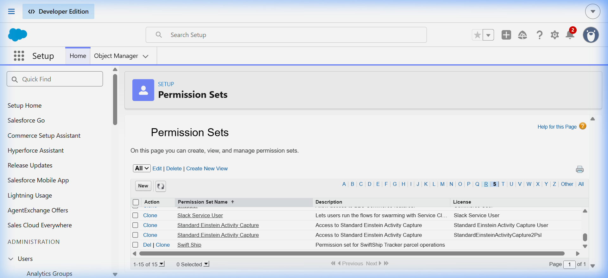
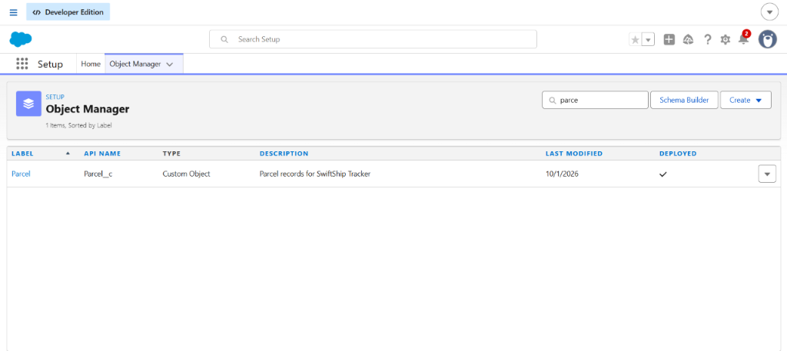
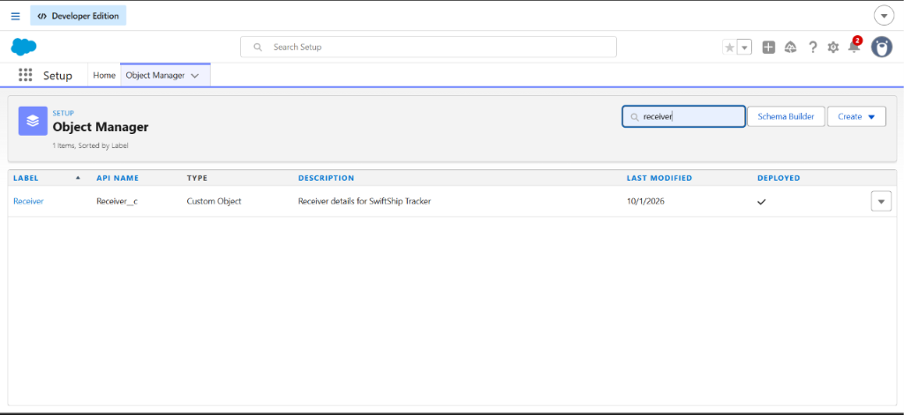

# 📸 Salesforce Implementation Screenshots

This folder contains verified, high-resolution evidence captured directly from the live Salesforce Developer Edition environment (`00Dak00001IgVqvEAF`) for the **SwiftShip Tracker** project (Naan Mudhalvan — TNSDC, Alpha College of Engineering).

---

## 📑 Screenshots Index

| File Name | Salesforce Component | Category | Description |
| :--- | :--- | :--- | :--- |
| [`ss01_parcels_list_view.png`](ss01_parcels_list_view.png) | Parcels Tab | Custom App View | Active parcel records (`P-001` through `P-004`) with statuses, weights, and dates |
| [`ss02_deliveries_list_view.png`](ss02_deliveries_list_view.png) | Deliveries Tab | Custom App View | Active delivery tracking with Geolocation latitude/longitude coordinates |
| [`ss03_receivers_list_view.png`](ss03_receivers_list_view.png) | Receivers Tab | Custom App View | Recipient contact details and linked parcel relationships |
| [`ss04_obj_mgr_parcel.png`](ss04_obj_mgr_parcel.png) | Object Manager | Custom Schema | `Parcel__c` custom object definition, custom fields, and data types |
| [`ss05_obj_mgr_delivery.png`](ss05_obj_mgr_delivery.png) | Object Manager | Custom Schema | `Delivery__c` custom object with Geolocation and lookup fields |
| [`ss06_obj_mgr_sender.png`](ss06_obj_mgr_sender.png) | Object Manager | Custom Schema | `Sender__c` custom object definition and origin fields |
| [`ss07_obj_mgr_receiver.png`](ss07_obj_mgr_receiver.png) | Object Manager | Custom Schema | `Receiver__c` custom object definition and consignee fields |
| [`ss08_agentforce_agents_setup.png`](ss08_agentforce_agents_setup.png) | Setup > Agents | Agentforce | Active `Swift Tracker` autonomous Service Agent in Salesforce Setup |
| [`ss09_agentforce_builder_topic_action.png`](ss09_agentforce_builder_topic_action.png) | Agentforce Builder | Agentforce | `# Parcel Tracking` topic, instructions, and `Parcel Details` Flow Action binding |
| [`ss10_agentforce_live_test_grounded.png`](ss10_agentforce_live_test_grounded.png) | Agentforce Preview | Agentforce | Conversational chat testing showing grounded reasoning trace and formatted response |
| [`ss11_flows_setup_list.png`](ss11_flows_setup_list.png) | Setup > Flows | Process Automation | Active unmanaged `Parcel Details` Autolaunched Flow in Salesforce Setup |
| [`ss12_flow_builder_debug_canvas.png`](ss12_flow_builder_debug_canvas.png) | Flow Builder | Process Automation | Visual canvas execution, input `ids` assignment, record query, and output generation |
| [`ss13_permission_set.png`](ss13_permission_set.png) | Setup > Permission Sets | Security | `Swift Ship` permission set assignments for Admin and `EinsteinServiceAgent User` |
| [`ss14_parcel_record_detail.png`](ss14_parcel_record_detail.png) | Lightning Record Page | App Layout | Detailed record page layout for Parcel `P-001` with related lists |

---

## 🖼️ Gallery Preview

### 1. Agentforce Autonomous AI Agent
#### Live Grounded Reasoning Trace

#### Agentforce Builder `# Parcel Tracking` Topic & Action

#### Active Agents in Setup

---

### 2. Custom App & Live Operational Records
#### All Parcels View

#### All Deliveries View (GPS Geolocation Coordinates)

#### All Receivers View

#### Parcel Record Detail View

---

### 3. Process Automation (Flow Builder)
#### Flow Builder Debug Canvas

#### Active Flows in Setup

---

### 4. Security & Access Control
#### Swift Ship Permission Set Assignments

---

### 5. Custom Object Schemas
| Parcel Custom Object | Delivery Custom Object |
| :---: | :---: |
|  |  |

| Sender Custom Object | Receiver Custom Object |
| :---: | :---: |
|  |  |
